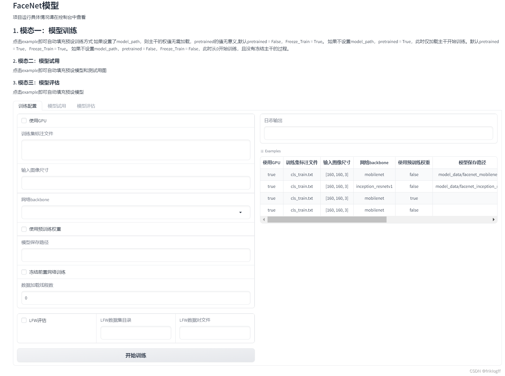
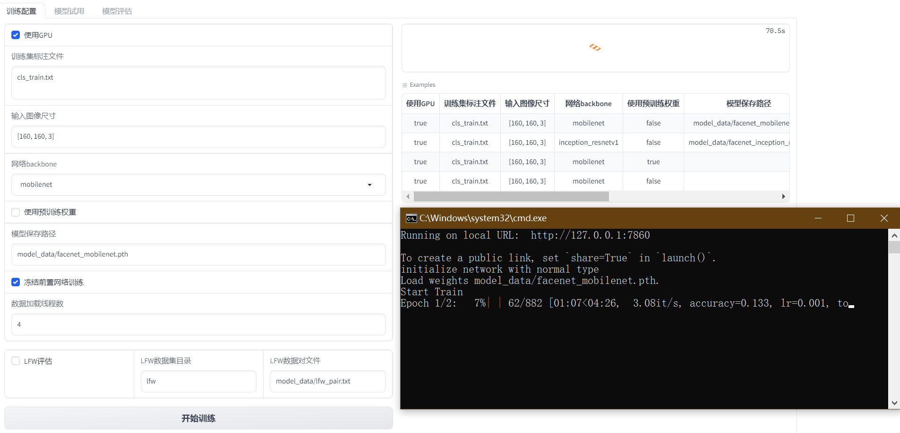
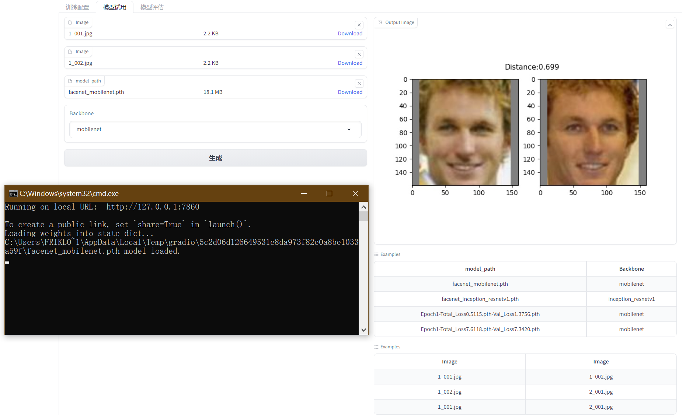
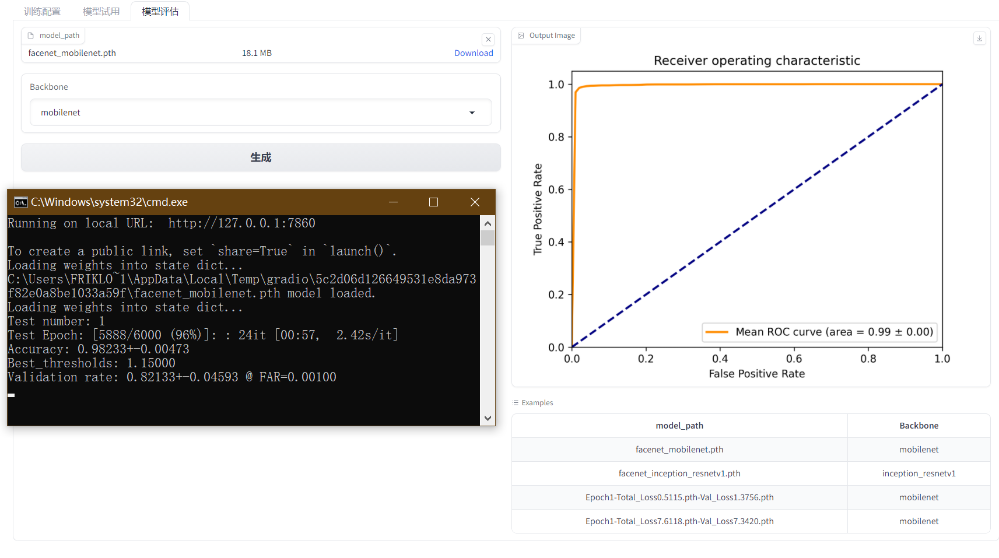

# FaceNet人脸识别模型

## 1. 模型训练

### 功能
训练FaceNet人脸识别模型。
### 参数
- Cuda: 是否使用GPU,布尔值。
- annotation_path: 训练集标注文件路径,字符串。
- input_shape: 输入图像大小,列表,如[160, 160, 3]。 
- backbone: 网络主干,字符串,可选mobilenet或resnet50。
- pretrained: 是否使用预训练权重,布尔值。 
- model_path: 模型保存路径,字符串。
- Freeze_Train: 是否冻结主干网络训练,布尔值。
- num_workers: 数据加载线程数,整数。
- lfw_eval_flag: 是否进行LFW数据集评估,布尔值。
- lfw_dir_path: LFW数据集路径,字符串。
- lfw_pairs_path: LFW pairs文件路径,字符串。
### 返回值
训练日志,字符串。
## 2. 模型试用

### 功能
使用训练好的模型对两张输入图像进行比较,判断是否为同一人。
### 参数
- image_1: 输入图像1,Image类型。
- image_2: 输入图像2,Image类型。 
- model_path: 模型文件路径,字符串。
- backbone: 模型主干网络,字符串,可选mobilenet或resnet50。
### 返回值 
比较结果图像,Image类型。
## 3. 模型评估

### 功能
在LFW数据集上评估模型性能。
### 参数
- model_path: 模型文件路径,字符串。
- backbone: 模型主干网络,字符串,可选mobilenet或resnet50。
### 返回值 
评估结果图像,Image类型。
## 使用说明
1. 点击左侧选项卡切换不同功能。
2. 输入相应的参数后点击按钮执行操作。
3. 结果将显示在右侧框中。
4. 可以点击Example查看参数示例。 （已编辑） 

# FaceNet人脸识别模型使用指南
## 前言
FaceNet是谷歌2015年提出的人脸识别模型,通过学习面部特征Embedding来实现面部识别。本指南介绍如何训练FaceNet模型、使用训练好的模型进行面部识别、以及在LFW数据集上评估模型性能。
## 1. 模型训练
### 功能
训练FaceNet人脸识别模型。
### 使用方法
1. 准备训练集数据,包含面部图像及标注文件。
2. 配置模型参数:
   - Cuda:是否使用GPU
   - annotation_path:训练集标注文件路径
   - input_shape:输入图像大小
   - backbone:主干网络,mobilenet或resnet50
   - pretrained:是否使用预训练权重
   - model_path:模型保存路径
   - Freeze_Train:是否冻结主干网络训练
   - num_workers:数据加载线程数
   - lfw_eval_flag:是否在LFW数据集上评估
   - lfw_dir_path:LFW数据集路径
   - lfw_pairs_path:LFW pairs文件路径
3. 运行train.py训练脚本,观察训练日志。
4. 训练完成后,模型及参数会保存到指定路径。
### 输出
训练日志,包括每轮迭代的loss等指标。
## 2. 模型预测
### 功能
使用训练好的模型对两张输入图像进行比较,判断是否为同一人。
### 使用方法
1. 准备两张人脸图像,存储为image_1.jpg和image_2.jpg。
2. 配置模型参数:
   - image_1:输入图像1路径 
   - image_2:输入图像2路径
   - model_path:模型文件路径
   - backbone:模型主干网络
3. 运行predict.py预测脚本。
### 输出
一张比较结果图像,标注两张输入图片是否为同一人。
## 3. 模型评估
### 功能
在LFW人脸验证数据集上评估模型性能。
### 使用方法
1. 下载LFW数据集,获取数据路径lfw_dir_path和pairs文件路径lfw_pairs_path。
2. 配置模型参数:
   - model_path:模型文件路径
   - backbone:模型主干网络 
3. 运行eval.py评估脚本。


## facenet_trainer.py
1. 导入所需的模块,包括Facenet模型,损失函数,数据集,训练过程等。
- numpy:用于一些数组操作
- torch:PyTorch深度学习框架
- torch.backends.cudnn:PyTorch的cuDNN加速模块
- torch.optim:PyTorch的优化器模块
- torch.utils.data:PyTorch的数据加载模块
- nets.facenet:Facenet模型的网络架构
- nets.facenet_training:Facenet的训练损失函数等
- utils.dataloader:数据加载类
- utils.utils_fit:模型训练的fit函数
各模块作用:
- numpy:数组操作
- torch:构建和训练模型
- cudnn:GPU加速
- optim:定义优化器
- data:数据加载
- nets.facenet:Facenet模型架构
- nets.facenet_training:Facenet的损失函数
- utils.dataloader:处理人脸数据集
- utils.utils_fit:训练过程的循环
2. get_num_classes函数统计数据集中有多少个类别,用于交叉熵损失函数。
4. train函数是主要的训练过程。
5. 加载Facenet模型,可以选择mobilenet等不同的backbone,是否加载预训练权重,模型路径等。
6. 定义交叉熵损失loss,创建LossHistory类记录训练过程中的损失变化。
7. 如果要评估模型,加载LFW数据集,并创建数据加载器。
8. 设置训练集、验证集比例,随机划分数据集。
9. 定义优化器Adam,学习率调度策略StepLR,批大小等超参数。
10. 创建训练集和验证集的数据加载器DataLoader。
11. 冻结backbone参数或解冻进行微调。
12. 在一个大循环里面,进行多次训练迭代:
    - 每次迭代对模型进行训练,计算损失等。
    - 在验证集上验证,记录指标如损失。
    - 进行学习率调整。
    - 保存模型并评估模型在LFW数据集上的效果。
13. 大循环结束后,可以重新定义参数,进行进一步训练以提高模型性能。
14. 整个过程完成了Facenet模型的训练、验证、测试等循环,是一个典型的模型训练流程。

```python
import numpy as np
import torch
import torch.backends.cudnn as cudnn
import torch.optim as optim
from torch.utils.data import DataLoader

from nets.facenet import Facenet
from nets.facenet_training import LossHistory, triplet_loss, weights_init
from utils.dataloader import FacenetDataset, LFWDataset, dataset_collate
from utils.utils_fit import fit_one_epoch


# ------------------------------------------------#
#   计算一共有多少个人，用于利用交叉熵辅助收敛
# ------------------------------------------------#
def get_num_classes(annotation_path):
    with open(annotation_path) as f:
        dataset_path = f.readlines()

    labels = []
    for path in dataset_path:
        path_split = path.split(";")
        labels.append(int(path_split[0]))
    num_classes = np.max(labels) + 1
    return num_classes


def train(Cuda=True, annotation_path="cls_train.txt", input_shape=[160, 160, 3],
          backbone="mobilenet", pretrained=False, model_path="model_data/facenet_mobilenet.pth",
          Freeze_Train=True, num_workers=4, lfw_eval_flag=True, lfw_dir_path="lfw",
          lfw_pairs_path="model_data/lfw_pair.txt"):
    num_classes = get_num_classes(annotation_path)
    # ---------------------------------#
    #   载入模型并加载预训练权重
    # ---------------------------------#
    model = Facenet(backbone=backbone, num_classes=num_classes, pretrained=pretrained)
    if not pretrained:
        weights_init(model)
    if model_path != '':
        # ------------------------------------------------------#
        #   权值文件请看README，百度网盘下载
        # ------------------------------------------------------#
        print('Load weights {}.'.format(model_path))
        device = torch.device('cuda' if torch.cuda.is_available() else 'cpu')
        model_dict = model.state_dict()
        pretrained_dict = torch.load(model_path, map_location=device)
        pretrained_dict = {k: v for k, v in pretrained_dict.items() if np.shape(model_dict[k]) == np.shape(v)}
        model_dict.update(pretrained_dict)
        model.load_state_dict(model_dict)

    model_train = model.train()
    if Cuda:
        model_train = torch.nn.DataParallel(model)
        cudnn.benchmark = True
        model_train = model_train.cuda()

    loss = triplet_loss()
    loss_history = LossHistory("logs")
    # ---------------------------------#
    #   LFW估计
    # ---------------------------------#
    LFW_loader = torch.utils.data.DataLoader(
        LFWDataset(dir=lfw_dir_path, pairs_path=lfw_pairs_path, image_size=input_shape), batch_size=32,
        shuffle=False) if lfw_eval_flag else None

    # -------------------------------------------------------#
    #   0.05用于验证，0.95用于训练
    # -------------------------------------------------------#
    val_split = 0.05
    with open(annotation_path, "r") as f:
        lines = f.readlines()
    np.random.seed(10101)
    np.random.shuffle(lines)
    np.random.seed(None)
    num_val = int(len(lines) * val_split)
    num_train = len(lines) - num_val

    if True:
        lr = 1e-3
        Batch_size = 64
        Init_Epoch = 0
        Interval_Epoch = 2

        epoch_step = num_train // Batch_size
        epoch_step_val = num_val // Batch_size

        if epoch_step == 0 or epoch_step_val == 0:
            raise ValueError("数据集过小，无法进行训练，请扩充数据集。")

        optimizer = optim.Adam(model_train.parameters(), lr)
        lr_scheduler = optim.lr_scheduler.StepLR(optimizer, step_size=1, gamma=0.94)

        train_dataset = FacenetDataset(input_shape, lines[:num_train], num_train, num_classes)
        val_dataset = FacenetDataset(input_shape, lines[num_train:], num_val, num_classes)

        gen = DataLoader(train_dataset, batch_size=Batch_size, num_workers=num_workers, pin_memory=True,
                         drop_last=True, collate_fn=dataset_collate)
        gen_val = DataLoader(val_dataset, batch_size=Batch_size, num_workers=num_workers, pin_memory=True,
                             drop_last=True, collate_fn=dataset_collate)

        if Freeze_Train:
            for param in model.backbone.parameters():
                param.requires_grad = False

        for epoch in range(Init_Epoch, Interval_Epoch):
            fit_one_epoch(model_train, model, loss_history, loss, optimizer, epoch, epoch_step, epoch_step_val, gen,
                          gen_val, Interval_Epoch, Cuda, LFW_loader, Batch_size, lfw_eval_flag)
            lr_scheduler.step()

    if True:
        lr = 1e-4
        Batch_size = 32
        Interval_Epoch = 2
        Epoch = 4

        epoch_step = num_train // Batch_size
        epoch_step_val = num_val // Batch_size

        if epoch_step == 0 or epoch_step_val == 0:
            raise ValueError("数据集过小，无法进行训练，请扩充数据集。")

        optimizer = optim.Adam(model_train.parameters(), lr)
        lr_scheduler = optim.lr_scheduler.StepLR(optimizer, step_size=1, gamma=0.94)

        train_dataset = FacenetDataset(input_shape, lines[:num_train], num_train, num_classes)
        val_dataset = FacenetDataset(input_shape, lines[num_train:], num_val, num_classes)

        gen = DataLoader(train_dataset, batch_size=Batch_size, num_workers=num_workers, pin_memory=True,
                         drop_last=True, collate_fn=dataset_collate)
        gen_val = DataLoader(val_dataset, batch_size=Batch_size, num_workers=num_workers, pin_memory=True,
                             drop_last=True, collate_fn=dataset_collate)

        if Freeze_Train:
            for param in model.backbone.parameters():
                param.requires_grad = True

        for epoch in range(Interval_Epoch, Epoch):
            fit_one_epoch(model_train, model, loss_history, loss, optimizer, epoch, epoch_step, epoch_step_val, gen,
                          gen_val, Epoch, Cuda, LFW_loader, Batch_size, lfw_eval_flag)
            lr_scheduler.step()


```

## eval_en 
这段代码主要是实现人脸识别模型的测试和评估。
1. 导入的模块及作用:
(1) numpy:用于处理数组和矩阵运算
(2) torch:PyTorch深度学习框架,提供张量和自动求导等功能
(3) torch.backends.cudnn:PyTorch的cuDNN后端,用于GPU加速
(4) tqdm:用于显示训练/测试进度条
(5) matplotlib.pyplot:绘图模块,这里用来绘制ROC曲线
(6) nets.facenet:导入Facenet人脸识别模型定义
(7) utils.dataloader:自定义的数据加载器,用于读取LFW数据集
(8) utils.utils_metrics:实现性能指标计算的函数
2. 函数及功能:
- (1) plot_roc:绘制ROC曲线
- (2) test:测试主要函数
   - 计算性能指标:tpr,fpr,accuracy等
   - 返回指标及预测距离、标签
- (3) evatest:测试流程主函数
   - 加载模型
   - 构建LFW测试集
   - 多轮测试
   - 计算保存指标
   - 绘制平均ROC曲线
3. 主要流程:
- (1) 导入所需模块
- (2) 定义plot_roc绘制ROC曲线函数
- (3) 定义test进行测试计算性能指标
- (4) 定义evatest作为测试流程的主函数
- (5) 在evatest中执行测试流程:
    - 构建测试集DataLoader
    - 多轮测试
    - 计算保存指标
    - 绘制ROC曲线
- (6) 调用evatest完成测试评估
- (7) evatest返回ROC曲线图

```python
import numpy as np
import torch
import torch.backends.cudnn as cudnn
from tqdm import tqdm
import matplotlib.pyplot as plt

from nets.facenet import Facenet
from utils.dataloader import LFWDataset
from utils.utils_metrics import evaluate

from sklearn.metrics import auc, roc_curve


def plot_roc(fpr, tpr, figure_name="roc.png"):
    roc_auc = auc(fpr, tpr)
    fig = plt.figure()
    lw = 2
    plt.plot(fpr, tpr, color='darkorange',
             lw=lw, label='ROC curve (area = %0.2f)' % roc_auc)
    plt.plot([0, 1], [0, 1], color='navy', lw=lw, linestyle='--')
    plt.xlim([0.0, 1.0])
    plt.ylim([0.0, 1.05])
    plt.xlabel('False Positive Rate')
    plt.ylabel('True Positive Rate')
    plt.title('Receiver operating characteristic')
    plt.legend(loc="lower right")
    fig.savefig(figure_name, dpi=fig.dpi)


def roc():
    # 加载多轮测试的性能指标
    test_results = np.load("test_results.npz")
    tpr_list = test_results['tpr']
    fpr_list = test_results['fpr']

    # 绘制ROC曲线
    mean_fpr = np.linspace(0, 1, 100)
    tprs = []
    aucs = []
    for i in range(len(tpr_list)):
        fpr, tpr = fpr_list[i], tpr_list[i]
        tprs.append(np.interp(mean_fpr, fpr, tpr))
        tprs[-1][0] = 0.0
        roc_auc = auc(fpr, tpr)
        aucs.append(roc_auc)

    mean_tpr = np.mean(tprs, axis=0)
    mean_tpr[-1] = 1.0
    mean_auc = auc(mean_fpr, mean_tpr)
    std_auc = np.std(aucs)
    plt.figure()
    plt.plot(mean_fpr, mean_tpr, color='darkorange',
             lw=2, label='Mean ROC curve (area = %0.2f $\pm$ %0.2f)' % (mean_auc, std_auc))
    plt.plot([0, 1], [0, 1], color='navy', lw=2, linestyle='--')
    plt.xlim([0.0, 1.0])
    plt.ylim([0.0, 1.05])
    plt.xlabel('False Positive Rate')
    plt.ylabel('True Positive Rate')
    plt.title('Receiver operating characteristic')
    plt.legend(loc="lower right")
    plt.savefig("./model_data/roc_test.png", dpi=300)
    plt.close()

def test(test_loader, model, cuda, log_interval, batch_size):
    model.eval()

    labels, distances = [], []

    pbar = tqdm(enumerate(test_loader))
    for batch_idx, (data_a, data_p, label) in pbar:
        with torch.no_grad():
            data_a, data_p = data_a.type(torch.FloatTensor), data_p.type(torch.FloatTensor)
            if cuda:
                data_a, data_p = data_a.cuda(), data_p.cuda()
            out_a, out_p = model(data_a), model(data_p)
            dists = torch.sqrt(torch.sum((out_a - out_p) ** 2, 1))

        distances.append(dists.data.cpu().numpy())
        labels.append(label.data.cpu().numpy())
        if batch_idx % log_interval == 0:
            pbar.set_description('Test Epoch: [{}/{} ({:.0f}%)]'.format(
                batch_idx * batch_size, len(test_loader.dataset),
                100. * batch_idx / len(test_loader)))

    labels = np.array([sublabel for label in labels for sublabel in label])
    distances = np.array([subdist for dist in distances for subdist in dist])
    tpr, fpr, accuracy, val, val_std, far, best_thresholds = evaluate(distances, labels)
    print('Accuracy: %2.5f+-%2.5f' % (np.mean(accuracy), np.std(accuracy)))
    print('Best_thresholds: %2.5f' % best_thresholds)
    print('Validation rate: %2.5f+-%2.5f @ FAR=%2.5f' % (val, val_std, far))

    return tpr, fpr, accuracy, val, val_std, far, best_thresholds, distances, labels


def evatest(model_path, backbone):
    cuda = True
    # backbone = "mobilenet"
    input_shape = [160, 160, 3]
    # model_path = "model_data/facenet_mobilenet.pth"
    lfw_dir_path = "lfw"
    lfw_pairs_path = "model_data/lfw_pair.txt"
    batch_size = 256
    log_interval = 1

    test_loader = torch.utils.data.DataLoader(
        LFWDataset(dir=lfw_dir_path, pairs_path=lfw_pairs_path, image_size=input_shape), batch_size=batch_size,
        shuffle=False)

    model = Facenet(backbone=backbone, mode="predict")

    print('Loading weights into state dict...')
    device = torch.device('cuda' if torch.cuda.is_available() else 'cpu')
    model.load_state_dict(torch.load(model_path, map_location=device), strict=False)
    model = model.eval()

    if cuda:
        model = torch.nn.DataParallel(model)
        cudnn.benchmark = True
        model = model.cuda()

    # 多轮测试
    num_tests = 1
    tpr_list, fpr_list, accuracy_list, val_list, val_std_list, far_list, best_thresholds_list = [], [], [], [], [], [], []
    distances_list, labels_list = [], []

    for i in range(num_tests):
        print('Test number:', i + 1)
        tpr, fpr, accuracy, val, val_std, far, best_thresholds, distances, labels = test(test_loader, model, cuda,
                                                                                         log_interval, batch_size)
        tpr_list.append(tpr)
        fpr_list.append(fpr)
        accuracy_list.append(accuracy)
        val_list.append(val)
        val_std_list.append(val_std)
        far_list.append(far)
        best_thresholds_list.append(best_thresholds)
        distances_list.append(distances)
        labels_list.append(labels)

    # 保存多轮测试的性能指标
    np.savez("test_results.npz",
             tpr=tpr_list, fpr=fpr_list,
             accuracy=accuracy_list, val=val_list, val_std=val_std_list,
             far=far_list, best_thresholds=best_thresholds_list,
             distances=distances_list, labels=labels_list)
    roc()
    return "model_data/roc_test.png"

```

## UI界面代码
这个代码实现了一个人脸识别模型的训练、试用和评估的完整流程:
1. 模型训练:
   - 定义了train_face_net函数,实现了人脸识别模型的训练。可以配置各种超参数,如使用GPU、训练集路径、输入图像大小、主干网络等。
   - 使用gradio构建了一个可视化的训练界面,可以通过界面调整参数并运行训练。
2. 模型试用:
   - 定义了detect_image_change函数,实现了模型对两张图像的人脸识别和比对。
   - 构建了试用界面,上传两张图像、模型文件后可以得到识别结果。
3. 模型评估:
   - 定义了eval_test函数,调用评估模块测试模型性能,绘制ROC曲线。
   - 构建了评估界面,上传模型文件后可以查看评估结果。
4. 使用gradio构建了一个包含三个页面的网络界面,分别对应模型的三个使用场景。
5. 界面可以通过样例快速体验各功能,同时可以自定义参数进行配置。
6. 整个项目实现了人脸识别任务的完整pipeline,包括模型训练、使用和评估,通过简洁的网页界面将模型应用展现出来。
总体来说,这个项目展示了如何利用gradio来构建机器学习模型的用户界面,使得模型的使用和体验更友好、简单。同时也呈现了一个端到端的人脸识别任务案例。 
```python
import gradio as gr
from facenet_trainer import train
from eval_en import evatest

def train_face_net(Cuda=True,
                   v annotation_path="cls_train.txt",
                   input_shape=[160, 160, 3],
                   backbone="mobilenet",
                   pretrained=False,
                   model_path="model_data/facenet_mobilenet.pth",
                   Freeze_Train=True,
                   num_workers=4,
                   lfw_eval_flag=False,
                   lfw_dir_path="lfw",
          lfw_pairs_path="model_data/lfw_pair.txt"):
    train(
        Cuda=Cuda,
        annotation_path=annotation_path,
        input_shape=eval(input_shape),
        backbone=backbone,
        pretrained=pretrained,
        model_path=model_path,
        Freeze_Train=Freeze_Train,
        num_workers=int(num_workers),
        lfw_eval_flag=lfw_eval_flag,
        lfw_dir_path=lfw_dir_path,
        lfw_pairs_path=lfw_pairs_path)
    return "训练结束，具体情况请在控制台中查看"


from enpre import detect_image
#
#
def detect_image_change(image_1, image_2, model_path, backbone):
    image_path1 = image_1.name
    image_path2 = image_2.name
    model_path = model_path.name
    result = detect_image(image_path1, image_path2, model_path, backbone)
    return result


def eval_test(model_path, backbone):
    model_path = model_path.name
    result = evatest(model_path, backbone)
    return result


if __name__ == "__main__":
    with gr.Blocks() as demo:
        gr.Markdown("""
        # FaceNet模型
        项目运行具体情况请在控制台中查看
        ## 1. 模态一：模型训练
        点击example即可自动填充预设训练方式
        如果设置了model_path，则主干的权值无需加载，pretrained的值无意义,默认pretrained = False，Freeze_Train = True。
        如果不设置model_path，pretrained = True，此时仅加载主干开始训练。默认pretrained = True，Freeze_Train = True。
        如果不设置model_path，pretrained = False，Freeze_Train = False，此时从0开始训练，且没有冻结主干的过程。
        ### 2. 模态二：模型试用
        点击example即可自动填充预设模型和测试用图
        ### 3. 模态三：模型评估
        点击example即可自动填充预设模型
        """)
        with gr.Tabs():
            with gr.TabItem("训练配置"):
                with gr.Row():
                    with gr.Column():  # 左边一列是输
                        cuda = gr.Checkbox(label="使用GPU")
                        annotation_path = gr.Textbox(lines=2, label="训练集标注文件")
                        input_shape = gr.Textbox(label="输入图像尺寸")
                        backbone = gr.Dropdown(["mobilenet", "resnet50"], label="网络backbone")
                        pretrained = gr.Checkbox(label="使用预训练权重")
                        model_path = gr.Textbox(label="模型保存路径")
                        freeze_train = gr.Checkbox(label="冻结前置网络训练")
                        num_workers = gr.Number(label="数据加载线程数")
                        with gr.Row():
                            lfw_eval = gr.Checkbox(label="LFW评估")
                            lfw_dir = gr.Textbox(label="LFW数据集目录")
                            lfw_pairs = gr.Textbox(label="LFW数据对文件")
                        train_button = gr.Button("开始训练")
                    with gr.Column():  # 右边一列是输出
                        log_box = gr.Textbox(label="日志输出")
                        gr.Examples(
                            examples=[
                                [True,
                                 "cls_train.txt",
                                 "[160, 160, 3]",
                                 "mobilenet",
                                 False,
                                 "model_data/facenet_mobilenet.pth",
                                 True,
                                 4,
                                 False,
                                 "lfw",
                                 "model_data/lfw_pair.txt"],
                                [True,
                                 "cls_train.txt",
                                 "[160, 160, 3]",
                                 "inception_resnetv1",
                                 False,
                                 "model_data/facenet_inception_resnetv1.pth",
                                 True,
                                 4,
                                 False,
                                 "lfw",
                                 "model_data/lfw_pair.txt"],
                                [True,
                                 "cls_train.txt",
                                 "[160, 160, 3]",
                                 "mobilenet",
                                 True,
                                 "",
                                 True,
                                 4,
                                 False,
                                 "lfw",
                                 "model_data/lfw_pair.txt"],
                                [True,
                                 "cls_train.txt",
                                 "[160, 160, 3]",
                                 "mobilenet",
                                 False,
                                 "",
                                 False,
                                 4,
                                 False,
                                 "lfw",
                                 "model_data/lfw_pair.txt"]
                            ],
                            inputs=[cuda, annotation_path, input_shape, backbone, pretrained, model_path, freeze_train,
                                    num_workers, lfw_eval, lfw_dir, lfw_pairs]
                        )
            train_button.click(fn=train_face_net,
                               inputs=[cuda, annotation_path, input_shape, backbone, pretrained, model_path,
                                       freeze_train,
                                       num_workers, lfw_eval, lfw_dir, lfw_pairs],
                               outputs=log_box)
            with gr.TabItem("模型试用"):
                # 一行 两列 左边一列是输入 右边一列是输出
                with gr.Row():
                    with gr.Column():  # 左边一列是输入
                        image_input1 = gr.File(label="Image")
                        image_input2 = gr.File(label="Image")
                        model_input = gr.File(label="model_path")
                        bone_input = gr.Dropdown(['mobilenet', 'resnet50'], label="Backbone")

                        # 生成、重置按钮（row：行）
                        with gr.Row():
                            image_button = gr.Button("生成")
                    with gr.Column():  # 右边一列是输出
                        # 输出框
                        image_output = gr.Image(label="Output Image")

                        # 样例框
                        gr.Examples(
                            examples=[
                                ["model_data/facenet_mobilenet.pth", "mobilenet"],
                                ['model_data/facenet_inception_resnetv1.pth', 'inception_resnetv1'],
                                ['logs/Epoch1-Total_Loss0.5115.pth-Val_Loss1.3756.pth', 'mobilenet'],
                                ['logs/Epoch1-Total_Loss7.6118.pth-Val_Loss7.3420.pth', 'mobilenet']
                            ],
                            inputs=[model_input, bone_input]
                        )

                        # 样例框
                        gr.Examples(
                            examples=[
                                ["img/1_001.jpg", "img/1_002.jpg"],
                                ["img/1_002.jpg", 'img/2_001.jpg'],
                                ["img/1_001.jpg", 'img/2_001.jpg']
                            ],
                            inputs=[image_input1, image_input2]
                        )
            image_button.click(fn=detect_image_change,
                               inputs=[image_input1, image_input2, model_input, bone_input],
                               outputs=image_output),
            with gr.TabItem("模型评估"):
                # 一行 两列 左边一列是输入 右边一列是输出
                with gr.Row():
                    with gr.Column():  # 左边一列是输入
                        eva_model_input = gr.File(label="model_path")
                        eva_bone_input = gr.Dropdown(['mobilenet', 'resnet50'], label="Backbone")
                        # 生成、重置按钮（row：行）
                        with gr.Row():
                            image_button = gr.Button("生成")
                    with gr.Column():  # 右边一列是输出
                        # 输出框
                        eva_image_output = gr.Image(label="Output Image")

                        # 样例框
                        gr.Examples(
                            examples=[
                                ["model_data/facenet_mobilenet.pth", "mobilenet"],
                                ['model_data/facenet_inception_resnetv1.pth', 'inception_resnetv1'],
                                ['logs/Epoch1-Total_Loss0.5115.pth-Val_Loss1.3756.pth', 'mobilenet'],
                                ['logs/Epoch1-Total_Loss7.6118.pth-Val_Loss7.3420.pth', 'mobilenet']
                            ],
                            inputs=[eva_model_input, eva_bone_input]
                        )
            image_button.click(fn=eval_test,
                               inputs=[eva_model_input, eva_bone_input],
                               outputs=eva_image_output),

    demo.launch()

```

## 运行环境
打包方式基于
[半自动化使用.bat手动打包迁移python项目
](https://blog.csdn.net/qq_42531954/article/details/131843603?spm=1001.2014.3001.5501)
- Python 3.8
- OpenCV
- Pytorch
- dlib
- gradio

```bash
rem 创建虚拟环境 
python -m venv venv
call venv\Scripts\activate.bat
pip install -i https://mirrors.aliyun.com/pypi/simple/ -r re.txt


python -m pip install -i https://mirrors.aliyun.com/pypi/simple/ --upgrade pip setuptools
pip install dlib-19.19.0-cp38-cp38-win_amd64.whl.whl
pip install -i https://mirrors.aliyun.com/pypi/simple/ opencv-python==4.5.3.56
pip install torch-1.7.1+cu110-cp38-cp38-win_amd64.whl
pip install torch==1.7.1+cu110 torchvision==0.8.2+cu110 torchaudio==0.7.2 -f https://download.pytorch.org/whl/torch_stable.html
pip install -i https://mirrors.aliyun.com/pypi/simple/ gradio
pip install -i https://mirrors.aliyun.com/pypi/simple/ scikit-learn
pip install -i https://mirrors.aliyun.com/pypi/simple/ -r requirements.txt
```

```bash
scipy==1.7.1
numpy==1.21.2
matplotlib==3.4.3
opencv_python==4.5.3.56
torch==1.7.1
torchvision==0.8.2
tqdm==4.62.2
Pillow==8.3.2
h5py==2.10.0
```

## 总结
