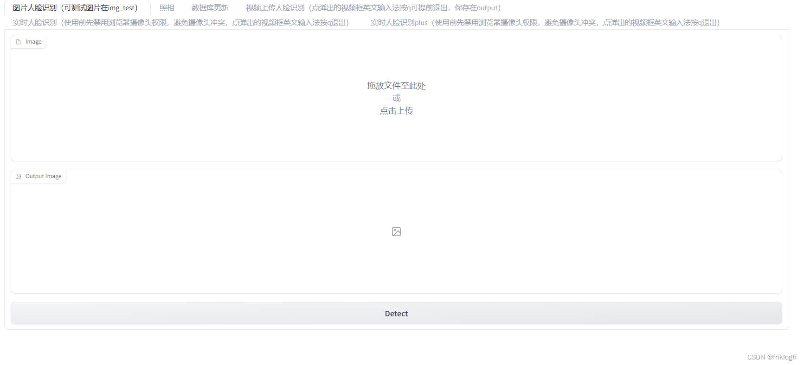
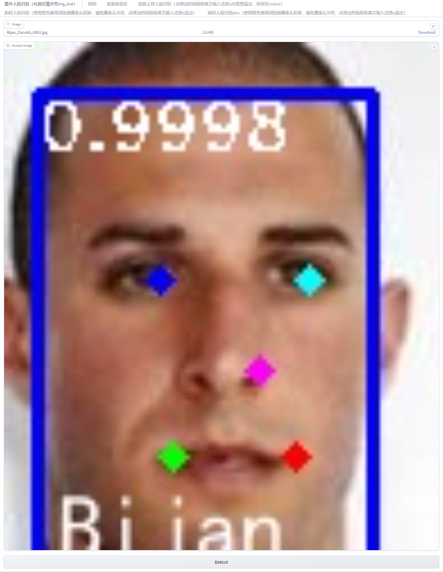
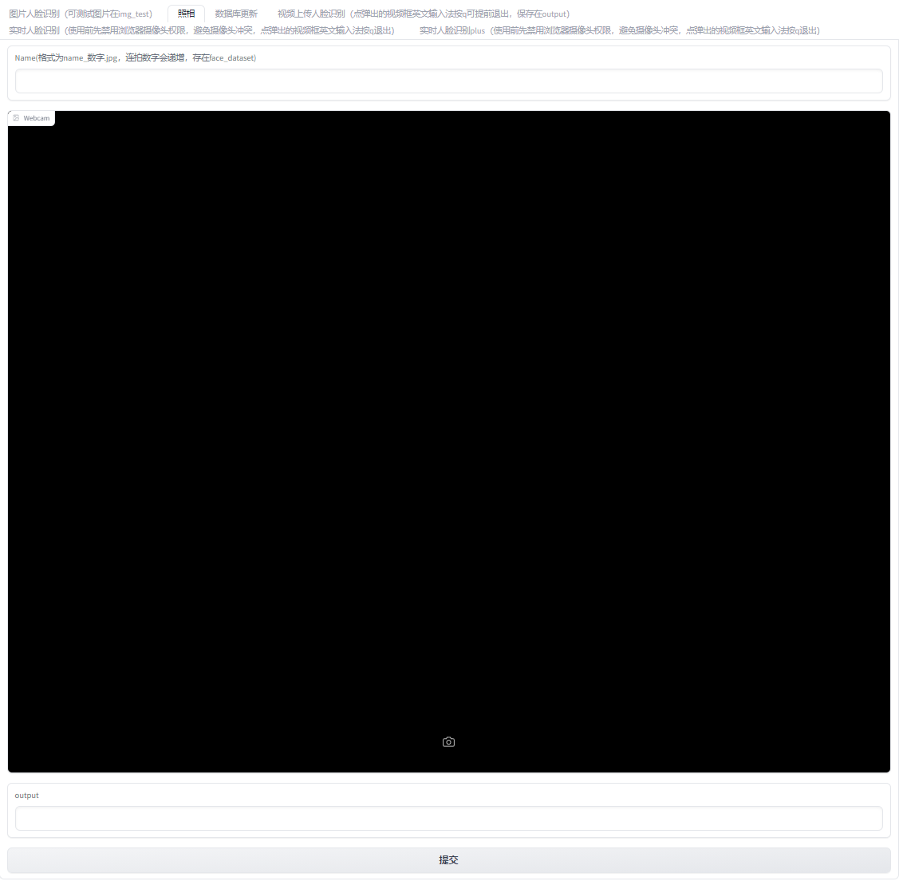
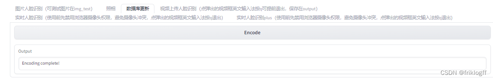
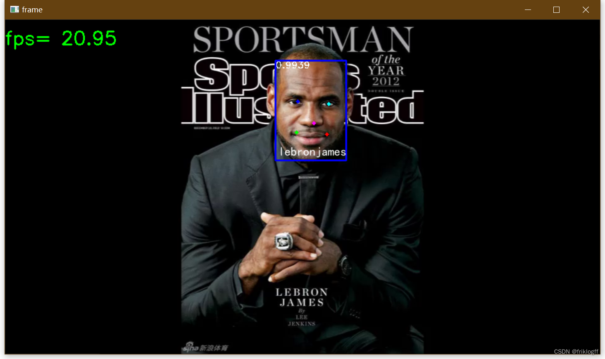
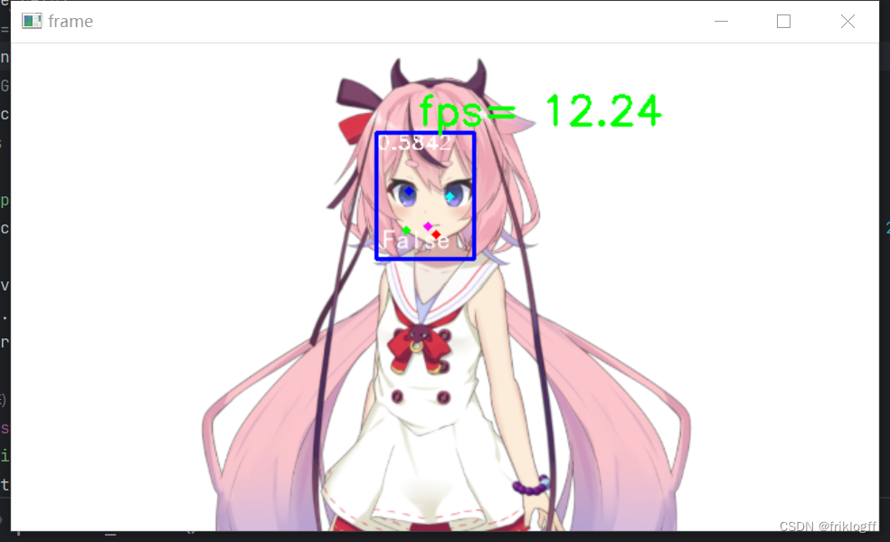

# 人脸识别系统
## 前言
本文将详细介绍这个人脸检测与识别系统的功能实现。该系统使用深度学习模型,能够对图片、视频甚至实时摄像头流进行人脸检测、识别与采集。它既实现了强大的人脸分析后端算法,也开发了方便用户使用的网页交互界面。
## 功能介绍

### 1. 图片人脸识别

- 用户可以上传一张图片
- 点击“Detect”按钮后,对图片进行人脸检测和识别
- 输出带有人脸标注框的图片

### 2. 摄像头人脸采集

- 用户输入姓名
- 点击“Start Webcam”开启摄像头
- 调整位置,点击“提交”按钮
- 将当前摄像头画面保存为图片,保存在面部数据集目录
### 3. 人脸数据库编码

- 点击“Encode”按钮
- 对人脸数据集所有图片进行面部特征编码
- 编码结果保存在模型文件中,用于后续人脸识别
### 4. 视频人脸识别
在这里插入图片描述
- 用户上传一个视频文件
- 点击“Upload”按钮对视频逐帧进行人脸检测和识别
- 生成带有人脸标注的结果视频
### 5. 实时视频人脸识别

- 点击“Start”按钮
- 开启摄像头实时进行人脸检测和识别
- 按“q”键退出
### 6. 实时视频人脸识别 Plus

- 在实时视频人脸识别的基础上，只支持一人单次活体识别，眨眼两次前默认为Flase
- 增加眨眼识别和最后一帧保存功能，
- 输出眨眼次数,保存眨眼时的最后一帧图片
## retinaface.py
这段代码实现了一个基于Retinaface和Facenet的人脸检测和识别系统。下面对代码进行详细解释：

1. 导入所需的库：导入了一些必要的库，
time：用于处理时间相关的操作。
cv2：OpenCV库，用于图像处理和显示。
numpy：用于数组和矩阵运算。
torch：PyTorch深度学习框架。
torch.nn：PyTorch中的神经网络模块。
PIL.Image：Python Imaging Library，用于图像处理。
PIL.ImageDraw：PIL中的绘图工具。
PIL.ImageFont：PIL中的字体管理器。
tqdm：进度条库，用于显示循环的进度。
此外，还导入了自定义的模块或函数：

nets.facenet：Facenet模型的定义。
nets_retinaface.retinaface：Retinaface模型的定义。
utils.anchors：生成Retinaface模型所需的先验框。
utils.config：配置文件，包含Retinaface和Facenet的参数设置。
utils.utils：一些辅助函数，如对图像进行预处理、计算特征向量等。
utils.utils_bbox：一些辅助函数，用于解码检测结果、非极大值抑制等。

2. 定义函数cv2ImgAddText：该函数用于在图像上添加中文文字。它将输入的图像转换为PIL格式，然后使用指定的字体和颜色，在图像上绘制文字，并返回绘制完成的图像。

3. 定义类Retinaface：该类封装了人脸检测和人脸识别的相关方法和参数。

-  __init__方法：初始化Retinaface模型和Facenet模型，并加载权重文件。根据传入的参数设置各项配置。

- encode_face_dataset方法：对输入的人脸图片进行编码，生成人脸特征向量，并保存到文件中。遍历所有输入的人脸图片，首先使用Retinaface网络检测人脸框，然后利用Facenet网络对每个人脸框进行编码得到128维的特征向量。最后将特征向量保存到文件中。

- detect_image方法：对输入的图像进行人脸检测和人脸识别，并返回标注了人脸框和姓名的图像。首先使用Retinaface网络检测人脸框，然后利用Facenet网络对每个人脸框进行编码得到128维的特征向量。接着将特征向量与已知人脸特征向量进行比对，找出最相似的人脸，并返回其姓名。最后在图像上绘制人脸框和姓名。

- live_detect_image方法：与detect_image方法类似，但可以根据flag参数判断是否需要进行人脸识别。如果flag为0，则直接将人脸标记为"False"，表示未识别成功。


4. 主程序部分：创建了一个Retinaface对象，并调用其中的方法来实现具体的功能。

总的来说，这段代码使用Retinaface网络进行人脸检测，然后利用Facenet网络对检测到的人脸进行编码和比对，从而实现人脸识别的功能。它可以对单张图片进行处理，也可以实时处理视频流，并且提供了计算帧率的功能。

```python
import time

import cv2
import numpy as np
import torch
import torch.nn as nn
from PIL import Image, ImageDraw, ImageFont
from tqdm import tqdm

from nets.facenet import Facenet
from nets_retinaface.retinaface import RetinaFace
from utils.anchors import Anchors
from utils.config import cfg_mnet, cfg_re50
from utils.utils import (Alignment_1, compare_faces, letterbox_image,
                         preprocess_input)
from utils.utils_bbox import (decode, decode_landm, non_max_suppression,
                              retinaface_correct_boxes)

# --------------------------------------#
#   写中文需要转成PIL来写。
# --------------------------------------#

def cv2ImgAddText(img, label, left, top, textColor=(255, 255, 255)):
    img = Image.fromarray(np.uint8(img))
    # ---------------#
    #   设置字体
    # ---------------#
    font = ImageFont.truetype(font='model_data/simhei.ttf', size=20)

    draw = ImageDraw.Draw(img)
    label = label.encode('utf-8')
    draw.text((left, top), str(label, 'UTF-8'), fill=textColor, font=font)
    return np.asarray(img)


# --------------------------------------#
#   一定注意backbone和model_path的对应。
#   在更换facenet_model后，
#   一定要注意重新编码人脸。
# --------------------------------------#
class Retinaface(object):
    _defaults = {
        # ----------------------------------------------------------------------#
        #   retinaface训练完的权值路径
        # ----------------------------------------------------------------------#
        "retinaface_model_path": 'model_data/Retinaface_mobilenet0.25.pth',
        # ----------------------------------------------------------------------#
        #   retinaface所使用的主干网络，有mobilenet和resnet50
        # ----------------------------------------------------------------------#
        "retinaface_backbone": "mobilenet",
        # ----------------------------------------------------------------------#
        #   retinaface中只有得分大于置信度的预测框会被保留下来
        # ----------------------------------------------------------------------#
        "confidence": 0.5,
        # ----------------------------------------------------------------------#
        #   retinaface中非极大抑制所用到的nms_iou大小
        # ----------------------------------------------------------------------#
        "nms_iou": 0.3,
        # ----------------------------------------------------------------------#
        #   是否需要进行图像大小限制。
        #   输入图像大小会大幅度地影响FPS，想加快检测速度可以减少input_shape。
        #   开启后，会将输入图像的大小限制为input_shape。否则使用原图进行预测。
        #   会导致检测结果偏差，主干为resnet50不存在此问题。
        #   可根据输入图像的大小自行调整input_shape，注意为32的倍数，如[640, 640, 3]
        # ----------------------------------------------------------------------#
        "retinaface_input_shape": [640, 640, 3],
        # ----------------------------------------------------------------------#
        #   是否需要进行图像大小限制。
        # ----------------------------------------------------------------------#
        "letterbox_image": True,

        # ----------------------------------------------------------------------#
        #   facenet训练完的权值路径
        # ----------------------------------------------------------------------#
        "facenet_model_path": 'model_data/facenet_mobilenet.pth',
        # ----------------------------------------------------------------------#
        #   facenet所使用的主干网络， mobilenet和inception_resnetv1
        # ----------------------------------------------------------------------#
        "facenet_backbone": "mobilenet",
        # ----------------------------------------------------------------------#
        #   facenet所使用到的输入图片大小
        # ----------------------------------------------------------------------#
        "facenet_input_shape": [160, 160, 3],
        # ----------------------------------------------------------------------#
        #   facenet所使用的人脸距离门限
        # ----------------------------------------------------------------------#
        "facenet_threhold": 0.9,

        # --------------------------------#
        #   是否使用Cuda
        #   没有GPU可以设置成False
        # --------------------------------#
        "cuda": True
    }

    @classmethod
    def get_defaults(cls, n):
        if n in cls._defaults:
            return cls._defaults[n]
        else:
            return "Unrecognized attribute name '" + n + "'"

    # ---------------------------------------------------#
    #   初始化Retinaface
    # ---------------------------------------------------#
    def __init__(self, encoding=0, **kwargs):
        self.__dict__.update(self._defaults)
        for name, value in kwargs.items():
            setattr(self, name, value)

        # ---------------------------------------------------#
        #   不同主干网络的config信息
        # ---------------------------------------------------#
        if self.retinaface_backbone == "mobilenet":
            self.cfg = cfg_mnet
        else:
            self.cfg = cfg_re50

        # ---------------------------------------------------#
        #   先验框的生成
        # ---------------------------------------------------#
        self.anchors = Anchors(self.cfg, image_size=(
        self.retinaface_input_shape[0], self.retinaface_input_shape[1])).get_anchors()
        self.generate()

        try:
            self.known_face_encodings = np.load(
                "model_data/{backbone}_face_encoding.npy".format(backbone=self.facenet_backbone))
            self.known_face_names = np.load("model_data/{backbone}_names.npy".format(backbone=self.facenet_backbone))
        except:
            if not encoding:
                print("载入已有人脸特征失败，请检查model_data下面是否生成了相关的人脸特征文件。")
            pass

    # ---------------------------------------------------#
    #   获得所有的分类
    # ---------------------------------------------------#
    def generate(self):
        # -------------------------------#
        #   载入模型与权值
        # -------------------------------#
        self.net = RetinaFace(cfg=self.cfg, phase='eval', pre_train=False).eval()
        self.facenet = Facenet(backbone=self.facenet_backbone, mode="predict").eval()

        print('Loading weights into state dict...')
        state_dict = torch.load(self.retinaface_model_path)
        self.net.load_state_dict(state_dict)

        state_dict = torch.load(self.facenet_model_path)
        self.facenet.load_state_dict(state_dict, strict=False)

        if self.cuda:
            self.net = nn.DataParallel(self.net)
            self.net = self.net.cuda()

            self.facenet = nn.DataParallel(self.facenet)
            self.facenet = self.facenet.cuda()
        print('Finished!')

    def encode_face_dataset(self, image_paths, names):
        face_encodings = []
        for index, path in enumerate(tqdm(image_paths)):
            # ---------------------------------------------------#
            #   打开人脸图片
            # ---------------------------------------------------#
            image = np.array(Image.open(path), np.float32)
            # ---------------------------------------------------#
            #   对输入图像进行一个备份
            # ---------------------------------------------------#
            old_image = image.copy()
            # ---------------------------------------------------#
            #   计算输入图片的高和宽
            # ---------------------------------------------------#
            im_height, im_width, _ = np.shape(image)
            # ---------------------------------------------------#
            #   计算scale，用于将获得的预测框转换成原图的高宽
            # ---------------------------------------------------#
            scale = [
                np.shape(image)[1], np.shape(image)[0], np.shape(image)[1], np.shape(image)[0]
            ]
            scale_for_landmarks = [
                np.shape(image)[1], np.shape(image)[0], np.shape(image)[1], np.shape(image)[0],
                np.shape(image)[1], np.shape(image)[0], np.shape(image)[1], np.shape(image)[0],
                np.shape(image)[1], np.shape(image)[0]
            ]
            if self.letterbox_image:
                image = letterbox_image(image, [self.retinaface_input_shape[1], self.retinaface_input_shape[0]])
                anchors = self.anchors
            else:
                anchors = Anchors(self.cfg, image_size=(im_height, im_width)).get_anchors()

            # ---------------------------------------------------#
            #   将处理完的图片传入Retinaface网络当中进行预测
            # ---------------------------------------------------#
            with torch.no_grad():
                # -----------------------------------------------------------#
                #   图片预处理，归一化。
                # -----------------------------------------------------------#
                image = torch.from_numpy(preprocess_input(image).transpose(2, 0, 1)).unsqueeze(0).type(
                    torch.FloatTensor)

                if self.cuda:
                    image = image.cuda()
                    anchors = anchors.cuda()

                loc, conf, landms = self.net(image)
                # -----------------------------------------------------------#
                #   对预测框进行解码
                # -----------------------------------------------------------#
                boxes = decode(loc.data.squeeze(0), anchors, self.cfg['variance'])
                # -----------------------------------------------------------#
                #   获得预测结果的置信度
                # -----------------------------------------------------------#
                conf = conf.data.squeeze(0)[:, 1:2]
                # -----------------------------------------------------------#
                #   对人脸关键点进行解码
                # -----------------------------------------------------------#
                landms = decode_landm(landms.data.squeeze(0), anchors, self.cfg['variance'])

                # -----------------------------------------------------------#
                #   对人脸检测结果进行堆叠
                # -----------------------------------------------------------#
                boxes_conf_landms = torch.cat([boxes, conf, landms], -1)
                boxes_conf_landms = non_max_suppression(boxes_conf_landms, self.confidence)

                if len(boxes_conf_landms) <= 0:
                    print(names[index], "：未检测到人脸")
                    continue
                # ---------------------------------------------------------#
                #   如果使用了letterbox_image的话，要把灰条的部分去除掉。
                # ---------------------------------------------------------#
                if self.letterbox_image:
                    boxes_conf_landms = retinaface_correct_boxes(boxes_conf_landms, \
                                                                 np.array([self.retinaface_input_shape[0],
                                                                           self.retinaface_input_shape[1]]),
                                                                 np.array([im_height, im_width]))

            boxes_conf_landms[:, :4] = boxes_conf_landms[:, :4] * scale
            boxes_conf_landms[:, 5:] = boxes_conf_landms[:, 5:] * scale_for_landmarks

            # ---------------------------------------------------#
            #   选取最大的人脸框。
            # ---------------------------------------------------#
            best_face_location = None
            biggest_area = 0
            for result in boxes_conf_landms:
                left, top, right, bottom = result[0:4]

                w = right - left
                h = bottom - top
                if w * h > biggest_area:
                    biggest_area = w * h
                    best_face_location = result

            # ---------------------------------------------------#
            #   截取图像
            # ---------------------------------------------------#
            crop_img = old_image[int(best_face_location[1]):int(best_face_location[3]),
                       int(best_face_location[0]):int(best_face_location[2])]
            landmark = np.reshape(best_face_location[5:], (5, 2)) - np.array(
                [int(best_face_location[0]), int(best_face_location[1])])
            crop_img, _ = Alignment_1(crop_img, landmark)

            crop_img = np.array(
                letterbox_image(np.uint8(crop_img), (self.facenet_input_shape[1], self.facenet_input_shape[0]))) / 255
            crop_img = crop_img.transpose(2, 0, 1)
            crop_img = np.expand_dims(crop_img, 0)
            # ---------------------------------------------------#
            #   利用图像算取长度为128的特征向量
            # ---------------------------------------------------#
            with torch.no_grad():
                crop_img = torch.from_numpy(crop_img).type(torch.FloatTensor)
                if self.cuda:
                    crop_img = crop_img.cuda()

                face_encoding = self.facenet(crop_img)[0].cpu().numpy()
                face_encodings.append(face_encoding)

        np.save("model_data/{backbone}_face_encoding.npy".format(backbone=self.facenet_backbone), face_encodings)
        np.save("model_data/{backbone}_names.npy".format(backbone=self.facenet_backbone), names)

    # ---------------------------------------------------#
    #   检测图片
    # ---------------------------------------------------#
    def detect_image(self, image):
        # ---------------------------------------------------#
        #   对输入图像进行一个备份，后面用于绘图
        # ---------------------------------------------------#
        old_image = image.copy()
        # ---------------------------------------------------#
        #   把图像转换成numpy的形式
        # ---------------------------------------------------#
        image = np.array(image, np.float32)

        # ---------------------------------------------------#
        #   Retinaface检测部分-开始
        # ---------------------------------------------------#
        # ---------------------------------------------------#
        #   计算输入图片的高和宽
        # ---------------------------------------------------#
        im_height, im_width, _ = np.shape(image)
        # ---------------------------------------------------#
        #   计算scale，用于将获得的预测框转换成原图的高宽
        # ---------------------------------------------------#
        scale = [
            np.shape(image)[1], np.shape(image)[0], np.shape(image)[1], np.shape(image)[0]
        ]
        scale_for_landmarks = [
            np.shape(image)[1], np.shape(image)[0], np.shape(image)[1], np.shape(image)[0],
            np.shape(image)[1], np.shape(image)[0], np.shape(image)[1], np.shape(image)[0],
            np.shape(image)[1], np.shape(image)[0]
        ]

        # ---------------------------------------------------------#
        #   letterbox_image可以给图像增加灰条，实现不失真的resize
        # ---------------------------------------------------------#
        if self.letterbox_image:
            image = letterbox_image(image, [self.retinaface_input_shape[1], self.retinaface_input_shape[0]])
            anchors = self.anchors
        else:
            anchors = Anchors(self.cfg, image_size=(im_height, im_width)).get_anchors()

        # ---------------------------------------------------#
        #   将处理完的图片传入Retinaface网络当中进行预测
        # ---------------------------------------------------#
        with torch.no_grad():
            # -----------------------------------------------------------#
            #   图片预处理，归一化。
            # -----------------------------------------------------------#
            image = torch.from_numpy(preprocess_input(image).transpose(2, 0, 1)).unsqueeze(0).type(torch.FloatTensor)

            if self.cuda:
                anchors = anchors.cuda()
                image = image.cuda()

            # ---------------------------------------------------------#
            #   传入网络进行预测
            # ---------------------------------------------------------#
            loc, conf, landms = self.net(image)
            # ---------------------------------------------------#
            #   Retinaface网络的解码，最终我们会获得预测框
            #   将预测结果进行解码和非极大抑制
            # ---------------------------------------------------#
            boxes = decode(loc.data.squeeze(0), anchors, self.cfg['variance'])

            conf = conf.data.squeeze(0)[:, 1:2]

            landms = decode_landm(landms.data.squeeze(0), anchors, self.cfg['variance'])

            # -----------------------------------------------------------#
            #   对人脸检测结果进行堆叠
            # -----------------------------------------------------------#
            boxes_conf_landms = torch.cat([boxes, conf, landms], -1)
            boxes_conf_landms = non_max_suppression(boxes_conf_landms, self.confidence)

            # ---------------------------------------------------#
            #   如果没有预测框则返回原图
            # ---------------------------------------------------#
            if len(boxes_conf_landms) <= 0:
                return old_image

            # ---------------------------------------------------------#
            #   如果使用了letterbox_image的话，要把灰条的部分去除掉。
            # ---------------------------------------------------------#
            if self.letterbox_image:
                boxes_conf_landms = retinaface_correct_boxes(boxes_conf_landms, \
                                                             np.array([self.retinaface_input_shape[0],
                                                                       self.retinaface_input_shape[1]]),
                                                             np.array([im_height, im_width]))

            boxes_conf_landms[:, :4] = boxes_conf_landms[:, :4] * scale
            boxes_conf_landms[:, 5:] = boxes_conf_landms[:, 5:] * scale_for_landmarks

        # ---------------------------------------------------#
        #   Retinaface检测部分-结束
        # ---------------------------------------------------#

        # -----------------------------------------------#
        #   Facenet编码部分-开始
        # -----------------------------------------------#
        face_encodings = []
        for boxes_conf_landm in boxes_conf_landms:
            # ----------------------#
            #   图像截取，人脸矫正
            # ----------------------#
            boxes_conf_landm = np.maximum(boxes_conf_landm, 0)
            crop_img = np.array(old_image)[int(boxes_conf_landm[1]):int(boxes_conf_landm[3]),
                       int(boxes_conf_landm[0]):int(boxes_conf_landm[2])]
            landmark = np.reshape(boxes_conf_landm[5:], (5, 2)) - np.array(
                [int(boxes_conf_landm[0]), int(boxes_conf_landm[1])])
            crop_img, _ = Alignment_1(crop_img, landmark)

            # ----------------------#
            #   人脸编码
            # ----------------------#
            crop_img = np.array(
                letterbox_image(np.uint8(crop_img), (self.facenet_input_shape[1], self.facenet_input_shape[0]))) / 255
            crop_img = np.expand_dims(crop_img.transpose(2, 0, 1), 0)
            with torch.no_grad():
                crop_img = torch.from_numpy(crop_img).type(torch.FloatTensor)
                if self.cuda:
                    crop_img = crop_img.cuda()

                # -----------------------------------------------#
                #   利用facenet_model计算长度为128特征向量
                # -----------------------------------------------#
                face_encoding = self.facenet(crop_img)[0].cpu().numpy()
                face_encodings.append(face_encoding)
        # -----------------------------------------------#
        #   Facenet编码部分-结束
        # -----------------------------------------------#

        # -----------------------------------------------#
        #   人脸特征比对-开始
        # -----------------------------------------------#
        face_names = []
        for face_encoding in face_encodings:
            # -----------------------------------------------------#
            #   取出一张脸并与数据库中所有的人脸进行对比，计算得分
            # -----------------------------------------------------#
            matches, face_distances = compare_faces(self.known_face_encodings, face_encoding,
                                                    tolerance=self.facenet_threhold)
            name = "Unknown"
            # -----------------------------------------------------#
            #   取出这个最近人脸的评分
            #   取出当前输入进来的人脸，最接近的已知人脸的序号
            # -----------------------------------------------------#
            best_match_index = np.argmin(face_distances)
            if matches[best_match_index]:
                name = self.known_face_names[best_match_index]

            face_names.append(name)
        # -----------------------------------------------#
        #   人脸特征比对-结束
        # -----------------------------------------------#
        global fname
        for i, b in enumerate(boxes_conf_landms):
            text = "{:.4f}".format(b[4])
            b = list(map(int, b))
            # ---------------------------------------------------#
            #   b[0]-b[3]为人脸框的坐标，b[4]为得分
            # ---------------------------------------------------#
            cv2.rectangle(old_image, (b[0], b[1]), (b[2], b[3]), (0, 0, 255), 2)
            cx = b[0]
            cy = b[1] + 12
            cv2.putText(old_image, text, (cx, cy),
                        cv2.FONT_HERSHEY_DUPLEX, 0.5, (255, 255, 255))

            # ---------------------------------------------------#
            #   b[5]-b[14]为人脸关键点的坐标
            # ---------------------------------------------------#
            cv2.circle(old_image, (b[5], b[6]), 1, (0, 0, 255), 4)
            cv2.circle(old_image, (b[7], b[8]), 1, (0, 255, 255), 4)
            cv2.circle(old_image, (b[9], b[10]), 1, (255, 0, 255), 4)
            cv2.circle(old_image, (b[11], b[12]), 1, (0, 255, 0), 4)
            cv2.circle(old_image, (b[13], b[14]), 1, (255, 0, 0), 4)

            name = face_names[i]
            # font = cv2.FONT_HERSHEY_SIMPLEX
            # cv2.putText(old_image, name, (b[0] , b[3] - 15), font, 0.75, (255, 255, 255), 2) 
            # --------------------------------------------------------------#
            #   cv2不能写中文，加上这段可以，但是检测速度会有一定的下降。
            #   如果不是必须，可以换成cv2只显示英文。
            # --------------------------------------------------------------#
            old_image = cv2ImgAddText(old_image, name, b[0] + 5, b[3] - 25)

        return old_image

    def live_detect_image(self, image, flag):
        # ---------------------------------------------------#
        #   对输入图像进行一个备份，后面用于绘图
        # ---------------------------------------------------#
        old_image = image.copy()
        # ---------------------------------------------------#
        #   把图像转换成numpy的形式
        # ---------------------------------------------------#
        image = np.array(image, np.float32)

        # ---------------------------------------------------#
        #   Retinaface检测部分-开始
        # ---------------------------------------------------#
        # ---------------------------------------------------#
        #   计算输入图片的高和宽
        # ---------------------------------------------------#
        im_height, im_width, _ = np.shape(image)
        # ---------------------------------------------------#
        #   计算scale，用于将获得的预测框转换成原图的高宽
        # ---------------------------------------------------#
        scale = [
            np.shape(image)[1], np.shape(image)[0], np.shape(image)[1], np.shape(image)[0]
        ]
        scale_for_landmarks = [
            np.shape(image)[1], np.shape(image)[0], np.shape(image)[1], np.shape(image)[0],
            np.shape(image)[1], np.shape(image)[0], np.shape(image)[1], np.shape(image)[0],
            np.shape(image)[1], np.shape(image)[0]
        ]

        # ---------------------------------------------------------#
        #   letterbox_image可以给图像增加灰条，实现不失真的resize
        # ---------------------------------------------------------#
        if self.letterbox_image:
            image = letterbox_image(image, [self.retinaface_input_shape[1], self.retinaface_input_shape[0]])
            anchors = self.anchors
        else:
            anchors = Anchors(self.cfg, image_size=(im_height, im_width)).get_anchors()

        # ---------------------------------------------------#
        #   将处理完的图片传入Retinaface网络当中进行预测
        # ---------------------------------------------------#
        with torch.no_grad():
            # -----------------------------------------------------------#
            #   图片预处理，归一化。
            # -----------------------------------------------------------#
            image = torch.from_numpy(preprocess_input(image).transpose(2, 0, 1)).unsqueeze(0).type(torch.FloatTensor)

            if self.cuda:
                anchors = anchors.cuda()
                image = image.cuda()

            # ---------------------------------------------------------#
            #   传入网络进行预测
            # ---------------------------------------------------------#
            loc, conf, landms = self.net(image)
            # ---------------------------------------------------#
            #   Retinaface网络的解码，最终我们会获得预测框
            #   将预测结果进行解码和非极大抑制
            # ---------------------------------------------------#
            boxes = decode(loc.data.squeeze(0), anchors, self.cfg['variance'])

            conf = conf.data.squeeze(0)[:, 1:2]

            landms = decode_landm(landms.data.squeeze(0), anchors, self.cfg['variance'])

            # -----------------------------------------------------------#
            #   对人脸检测结果进行堆叠
            # -----------------------------------------------------------#
            boxes_conf_landms = torch.cat([boxes, conf, landms], -1)
            boxes_conf_landms = non_max_suppression(boxes_conf_landms, self.confidence)

            # ---------------------------------------------------#
            #   如果没有预测框则返回原图
            # ---------------------------------------------------#
            if len(boxes_conf_landms) <= 0:
                return old_image

            # ---------------------------------------------------------#
            #   如果使用了letterbox_image的话，要把灰条的部分去除掉。
            # ---------------------------------------------------------#
            if self.letterbox_image:
                boxes_conf_landms = retinaface_correct_boxes(boxes_conf_landms, \
                                                             np.array([self.retinaface_input_shape[0],
                                                                       self.retinaface_input_shape[1]]),
                                                             np.array([im_height, im_width]))

            boxes_conf_landms[:, :4] = boxes_conf_landms[:, :4] * scale
            boxes_conf_landms[:, 5:] = boxes_conf_landms[:, 5:] * scale_for_landmarks

        # ---------------------------------------------------#
        #   Retinaface检测部分-结束
        # ---------------------------------------------------#

        # -----------------------------------------------#
        #   Facenet编码部分-开始
        # -----------------------------------------------#
        face_encodings = []
        for boxes_conf_landm in boxes_conf_landms:
            # ----------------------#
            #   图像截取，人脸矫正
            # ----------------------#
            boxes_conf_landm = np.maximum(boxes_conf_landm, 0)
            crop_img = np.array(old_image)[int(boxes_conf_landm[1]):int(boxes_conf_landm[3]),
                       int(boxes_conf_landm[0]):int(boxes_conf_landm[2])]
            landmark = np.reshape(boxes_conf_landm[5:], (5, 2)) - np.array(
                [int(boxes_conf_landm[0]), int(boxes_conf_landm[1])])
            crop_img, _ = Alignment_1(crop_img, landmark)

            # ----------------------#
            #   人脸编码
            # ----------------------#
            crop_img = np.array(
                letterbox_image(np.uint8(crop_img), (self.facenet_input_shape[1], self.facenet_input_shape[0]))) / 255
            crop_img = np.expand_dims(crop_img.transpose(2, 0, 1), 0)
            with torch.no_grad():
                crop_img = torch.from_numpy(crop_img).type(torch.FloatTensor)
                if self.cuda:
                    crop_img = crop_img.cuda()

                # -----------------------------------------------#
                #   利用facenet_model计算长度为128特征向量
                # -----------------------------------------------#
                face_encoding = self.facenet(crop_img)[0].cpu().numpy()
                face_encodings.append(face_encoding)
        # -----------------------------------------------#
        #   Facenet编码部分-结束
        # -----------------------------------------------#

        # -----------------------------------------------#
        #   人脸特征比对-开始
        # -----------------------------------------------#
        face_names = []
        for face_encoding in face_encodings:
            # -----------------------------------------------------#
            #   取出一张脸并与数据库中所有的人脸进行对比，计算得分
            # -----------------------------------------------------#
            matches, face_distances = compare_faces(self.known_face_encodings, face_encoding,
                                                    tolerance=self.facenet_threhold)
            name = "Unknown"
            # -----------------------------------------------------#
            #   取出这个最近人脸的评分
            #   取出当前输入进来的人脸，最接近的已知人脸的序号
            # -----------------------------------------------------#
            best_match_index = np.argmin(face_distances)
            if matches[best_match_index]:
                name = self.known_face_names[best_match_index]
            if flag == 0:
                name = "False"
            face_names.append(name)
        # -----------------------------------------------#
        #   人脸特征比对-结束
        # -----------------------------------------------#
        for i, b in enumerate(boxes_conf_landms):
            text = "{:.4f}".format(b[4])
            b = list(map(int, b))
            # ---------------------------------------------------#
            #   b[0]-b[3]为人脸框的坐标，b[4]为得分
            # ---------------------------------------------------#
            cv2.rectangle(old_image, (b[0], b[1]), (b[2], b[3]), (0, 0, 255), 2)
            cx = b[0]
            cy = b[1] + 12
            cv2.putText(old_image, text, (cx, cy),
                        cv2.FONT_HERSHEY_DUPLEX, 0.5, (255, 255, 255))

            # ---------------------------------------------------#
            #   b[5]-b[14]为人脸关键点的坐标
            # ---------------------------------------------------#
            cv2.circle(old_image, (b[5], b[6]), 1, (0, 0, 255), 4)
            cv2.circle(old_image, (b[7], b[8]), 1, (0, 255, 255), 4)
            cv2.circle(old_image, (b[9], b[10]), 1, (255, 0, 255), 4)
            cv2.circle(old_image, (b[11], b[12]), 1, (0, 255, 0), 4)
            cv2.circle(old_image, (b[13], b[14]), 1, (255, 0, 0), 4)

            name = face_names[i]
            # font = cv2.FONT_HERSHEY_SIMPLEX
            # cv2.putText(old_image, name, (b[0] , b[3] - 15), font, 0.75, (255, 255, 255), 2)
            # --------------------------------------------------------------#
            #   cv2不能写中文，加上这段可以，但是检测速度会有一定的下降。
            #   如果不是必须，可以换成cv2只显示英文。
            # --------------------------------------------------------------#
            old_image = cv2ImgAddText(old_image, name, b[0] + 5, b[3] - 25)
        return old_image


    def get_FPS(self, image, test_interval):
        # ---------------------------------------------------#
        #   对输入图像进行一个备份，后面用于绘图
        # ---------------------------------------------------#
        old_image = image.copy()
        # ---------------------------------------------------#
        #   把图像转换成numpy的形式
        # ---------------------------------------------------#
        image = np.array(image, np.float32)

        # ---------------------------------------------------#
        #   Retinaface检测部分-开始
        # ---------------------------------------------------#
        # ---------------------------------------------------#
        #   计算输入图片的高和宽
        # ---------------------------------------------------#
        im_height, im_width, _ = np.shape(image)
        # ---------------------------------------------------#
        #   计算scale，用于将获得的预测框转换成原图的高宽
        # ---------------------------------------------------#
        scale = [
            np.shape(image)[1], np.shape(image)[0], np.shape(image)[1], np.shape(image)[0]
        ]
        scale_for_landmarks = [
            np.shape(image)[1], np.shape(image)[0], np.shape(image)[1], np.shape(image)[0],
            np.shape(image)[1], np.shape(image)[0], np.shape(image)[1], np.shape(image)[0],
            np.shape(image)[1], np.shape(image)[0]
        ]

        # ---------------------------------------------------------#
        #   letterbox_image可以给图像增加灰条，实现不失真的resize
        # ---------------------------------------------------------#
        if self.letterbox_image:
            image = letterbox_image(image, [self.retinaface_input_shape[1], self.retinaface_input_shape[0]])
            anchors = self.anchors
        else:
            anchors = Anchors(self.cfg, image_size=(im_height, im_width)).get_anchors()

        # ---------------------------------------------------#
        #   将处理完的图片传入Retinaface网络当中进行预测
        # ---------------------------------------------------#
        with torch.no_grad():
            # -----------------------------------------------------------#
            #   图片预处理，归一化。
            # -----------------------------------------------------------#
            image = torch.from_numpy(preprocess_input(image).transpose(2, 0, 1)).unsqueeze(0).type(torch.FloatTensor)

            if self.cuda:
                anchors = anchors.cuda()
                image = image.cuda()

            # ---------------------------------------------------------#
            #   传入网络进行预测
            # ---------------------------------------------------------#
            loc, conf, landms = self.net(image)
            # ---------------------------------------------------#
            #   Retinaface网络的解码，最终我们会获得预测框
            #   将预测结果进行解码和非极大抑制
            # ---------------------------------------------------#
            boxes = decode(loc.data.squeeze(0), anchors, self.cfg['variance'])

            conf = conf.data.squeeze(0)[:, 1:2]

            landms = decode_landm(landms.data.squeeze(0), anchors, self.cfg['variance'])

            # -----------------------------------------------------------#
            #   对人脸检测结果进行堆叠
            # -----------------------------------------------------------#
            boxes_conf_landms = torch.cat([boxes, conf, landms], -1)
            boxes_conf_landms = non_max_suppression(boxes_conf_landms, self.confidence)

        if len(boxes_conf_landms) > 0:
            # ---------------------------------------------------------#
            #   如果使用了letterbox_image的话，要把灰条的部分去除掉。
            # ---------------------------------------------------------#
            if self.letterbox_image:
                boxes_conf_landms = retinaface_correct_boxes(boxes_conf_landms, \
                                                             np.array([self.retinaface_input_shape[0],
                                                                       self.retinaface_input_shape[1]]),
                                                             np.array([im_height, im_width]))

            boxes_conf_landms[:, :4] = boxes_conf_landms[:, :4] * scale
            boxes_conf_landms[:, 5:] = boxes_conf_landms[:, 5:] * scale_for_landmarks

            # ---------------------------------------------------#
            #   Retinaface检测部分-结束
            # ---------------------------------------------------#

            # -----------------------------------------------#
            #   Facenet编码部分-开始
            # -----------------------------------------------#
            face_encodings = []
            for boxes_conf_landm in boxes_conf_landms:
                # ----------------------#
                #   图像截取，人脸矫正
                # ----------------------#
                boxes_conf_landm = np.maximum(boxes_conf_landm, 0)
                crop_img = np.array(old_image)[int(boxes_conf_landm[1]):int(boxes_conf_landm[3]),
                           int(boxes_conf_landm[0]):int(boxes_conf_landm[2])]
                landmark = np.reshape(boxes_conf_landm[5:], (5, 2)) - np.array(
                    [int(boxes_conf_landm[0]), int(boxes_conf_landm[1])])
                crop_img, _ = Alignment_1(crop_img, landmark)

                # ----------------------#
                #   人脸编码
                # ----------------------#
                crop_img = np.array(letterbox_image(np.uint8(crop_img),
                                                    (self.facenet_input_shape[1], self.facenet_input_shape[0]))) / 255
                crop_img = np.expand_dims(crop_img.transpose(2, 0, 1), 0)
                with torch.no_grad():
                    crop_img = torch.from_numpy(crop_img).type(torch.FloatTensor)
                    if self.cuda:
                        crop_img = crop_img.cuda()

                    # -----------------------------------------------#
                    #   利用facenet_model计算长度为128特征向量
                    # -----------------------------------------------#
                    face_encoding = self.facenet(crop_img)[0].cpu().numpy()
                    face_encodings.append(face_encoding)
            # -----------------------------------------------#
            #   Facenet编码部分-结束
            # -----------------------------------------------#

            # -----------------------------------------------#
            #   人脸特征比对-开始
            # -----------------------------------------------#
            face_names = []
            for face_encoding in face_encodings:
                # -----------------------------------------------------#
                #   取出一张脸并与数据库中所有的人脸进行对比，计算得分
                # -----------------------------------------------------#
                matches, face_distances = compare_faces(self.known_face_encodings, face_encoding,
                                                        tolerance=self.facenet_threhold)
                name = "Unknown"
                # -----------------------------------------------------#
                #   取出这个最近人脸的评分
                #   取出当前输入进来的人脸，最接近的已知人脸的序号
                # -----------------------------------------------------#
                best_match_index = np.argmin(face_distances)
                if matches[best_match_index]:
                    name = self.known_face_names[best_match_index]
                face_names.append(name)
            # -----------------------------------------------#
            #   人脸特征比对-结束
            # -----------------------------------------------#

        t1 = time.time()
        for _ in range(test_interval):
            with torch.no_grad():
                # ---------------------------------------------------------#
                #   传入网络进行预测
                # ---------------------------------------------------------#
                loc, conf, landms = self.net(image)
                # ---------------------------------------------------#
                #   Retinaface网络的解码，最终我们会获得预测框
                #   将预测结果进行解码和非极大抑制
                # ---------------------------------------------------#
                boxes = decode(loc.data.squeeze(0), anchors, self.cfg['variance'])

                conf = conf.data.squeeze(0)[:, 1:2]

                landms = decode_landm(landms.data.squeeze(0), anchors, self.cfg['variance'])

                # -----------------------------------------------------------#
                #   对人脸检测结果进行堆叠
                # -----------------------------------------------------------#
                boxes_conf_landms = torch.cat([boxes, conf, landms], -1)
                boxes_conf_landms = non_max_suppression(boxes_conf_landms, self.confidence)

            if len(boxes_conf_landms) > 0:
                # ---------------------------------------------------------#
                #   如果使用了letterbox_image的话，要把灰条的部分去除掉。
                # ---------------------------------------------------------#
                if self.letterbox_image:
                    boxes_conf_landms = retinaface_correct_boxes(boxes_conf_landms, \
                                                                 np.array([self.retinaface_input_shape[0],
                                                                           self.retinaface_input_shape[1]]),
                                                                 np.array([im_height, im_width]))

                boxes_conf_landms[:, :4] = boxes_conf_landms[:, :4] * scale
                boxes_conf_landms[:, 5:] = boxes_conf_landms[:, 5:] * scale_for_landmarks

                # ---------------------------------------------------#
                #   Retinaface检测部分-结束
                # ---------------------------------------------------#

                # -----------------------------------------------#
                #   Facenet编码部分-开始
                # -----------------------------------------------#
                face_encodings = []
                for boxes_conf_landm in boxes_conf_landms:
                    # ----------------------#
                    #   图像截取，人脸矫正
                    # ----------------------#
                    boxes_conf_landm = np.maximum(boxes_conf_landm, 0)
                    crop_img = np.array(old_image)[int(boxes_conf_landm[1]):int(boxes_conf_landm[3]),
                               int(boxes_conf_landm[0]):int(boxes_conf_landm[2])]
                    landmark = np.reshape(boxes_conf_landm[5:], (5, 2)) - np.array(
                        [int(boxes_conf_landm[0]), int(boxes_conf_landm[1])])
                    crop_img, _ = Alignment_1(crop_img, landmark)

                    # ----------------------#
                    #   人脸编码
                    # ----------------------#
                    crop_img = np.array(letterbox_image(np.uint8(crop_img), (
                    self.facenet_input_shape[1], self.facenet_input_shape[0]))) / 255
                    crop_img = np.expand_dims(crop_img.transpose(2, 0, 1), 0)
                    with torch.no_grad():
                        crop_img = torch.from_numpy(crop_img).type(torch.FloatTensor)
                        if self.cuda:
                            crop_img = crop_img.cuda()

                        # -----------------------------------------------#
                        #   利用facenet_model计算长度为128特征向量
                        # -----------------------------------------------#
                        face_encoding = self.facenet(crop_img)[0].cpu().numpy()
                        face_encodings.append(face_encoding)
                # -----------------------------------------------#
                #   Facenet编码部分-结束
                # -----------------------------------------------#

                # -----------------------------------------------#
                #   人脸特征比对-开始
                # -----------------------------------------------#
                face_names = []
                for face_encoding in face_encodings:
                    # -----------------------------------------------------#
                    #   取出一张脸并与数据库中所有的人脸进行对比，计算得分
                    # -----------------------------------------------------#
                    matches, face_distances = compare_faces(self.known_face_encodings, face_encoding,
                                                            tolerance=self.facenet_threhold)
                    name = "Unknown"
                    # -----------------------------------------------------#
                    #   取出这个最近人脸的评分
                    #   取出当前输入进来的人脸，最接近的已知人脸的序号
                    # -----------------------------------------------------#
                    best_match_index = np.argmin(face_distances)
                    if matches[best_match_index]:
                        name = self.known_face_names[best_match_index]
                    face_names.append(name)
                # -----------------------------------------------#
                #   人脸特征比对-结束
                # -----------------------------------------------#
        t2 = time.time()
        tact_time = (t2 - t1) / test_interval
        return tact_time

```

## enperdict.py
这个代码实现了对视频和图片进行人脸检测和活体检测的功能,主要包含以下部分:
1. 一些工具函数:
   - _largest_face:从检测到的多张人脸中找到最大的一张
   - _eye_aspect_ratio:计算眼睛长宽比,用于眨眼检测
2. detect_image:对单张图片进行人脸检测
3. LiveVideoDetector类:
   - 初始化视频读取、人脸检测器、关键点检测器等
   - process_frame:读取一帧,进行人脸检测、眨眼检测和活体检测
   - release:释放资源
   - get_blink_counter:获得眨眼次数
   - get_fname:获得活体检测通过后的保存文件名
4. VideoDetector类:
   - 初始化视频读取
   - process_frame:读取一帧,进行人脸检测
   - release:释放资源

主要功能有:
1) detect_image可以对单张图片进行人脸检测
2) LiveVideoDetector可以对视频流进行人脸检测、眨眼检测实现活体检测
3) VideoDetector可以对视频流进行人脸检测


两个类通过读取视频帧,调用人脸检测模型,实现了视频流中人脸的检测和活体检测。
总体来说,代码实现了图片和视频人脸检测的基本流程,包含了一些额外的活体检测逻辑,可以用来构建视频监控、人脸识别等应用。
```python

import time

import cv2
import numpy as np

from retinaface import Retinaface
import dlib


def _largest_face(dets):
    if len(dets) == 1:
        return 0
    face_areas = [(det.right() - det.left()) * (det.bottom() - det.top()) for det in dets]
    largest_area = face_areas[0]
    largest_index = 0
    for index in range(1, len(dets)):
        if face_areas[index] > largest_area:
            largest_index = index
            largest_area = face_areas[index]
    print("largest_face index is {} in {} faces".format(largest_index, len(dets)))
    return largest_index


# 计算眼睛的长宽比：eye aspect ratio (EAR)
def _eye_aspect_ratio(eye):
    A = np.linalg.norm(eye[1] - eye[5])
    B = np.linalg.norm(eye[2] - eye[4])
    C = np.linalg.norm(eye[0] - eye[3])
    ear = (A + B) / (2.0 * C)
    return ear


# 对单张图片进行人脸检测
def detect_image(img, temp_img_path):
    retinaface = Retinaface()

    image = cv2.imread(img)
    if image is None:
        print('Open Error! Try again!')
        return
    else:
        image = cv2.cvtColor(image, cv2.COLOR_BGR2RGB)
        r_image = retinaface.detect_image(image)
        r_image = cv2.cvtColor(r_image, cv2.COLOR_RGB2BGR)
        # cv2.imshow("after", r_image)
        # cv2.waitKey(0)
        if temp_img_path != "":
            # 保存到临时文件
            cv2.imwrite(temp_img_path, r_image)
            print("Save processed img to the path :" + temp_img_path)
            return temp_img_path

        # 返回临时文件路径


class LiveVideoDetector:
    def __init__(self, video_path, video_save_path="", video_fps=25.0, use_camera=False):
        if use_camera:
            self.capture = cv2.VideoCapture(0)
        else:
            self.capture = cv2.VideoCapture(video_path)
        self.video_save_path = video_save_path
        if video_save_path != "":
            fourcc = cv2.VideoWriter_fourcc(*'XVID')
            size = (int(self.capture.get(cv2.CAP_PROP_FRAME_WIDTH)), int(self.capture.get(cv2.CAP_PROP_FRAME_HEIGHT)))
            self.out = cv2.VideoWriter(video_save_path, fourcc, video_fps, size)
        ref, frame = self.capture.read()
        if not ref:
            raise ValueError("未能正确读取摄像头（视频），请注意是否正确安装摄像头（是否正确填写视频路径）。")
        self.fps = 0.0
        self.frame_counter = 0
        self.blink_counter = 0
        self.detector = dlib.get_frontal_face_detector()
        self.predictor = dlib.shape_predictor("shape_predictor_68_face_landmarks.dat")
        self.flag = 0
        self.fname = None
        self.retinaface = Retinaface()

    def process_frame(self):
        t1 = time.time()
        ref, frame = self.capture.read()
        if not ref:
            return None
        gray = cv2.cvtColor(frame, cv2.COLOR_BGR2GRAY)
        faces = self.detector(gray, 0)
        # 集成眨眼检测
        if len(faces) != 0:
            largest_index = _largest_face(faces)
            face_rectangle = faces[largest_index]
            landmarks = np.matrix([[p.x, p.y] for p in self.predictor(frame, face_rectangle).parts()])
            left_eye = landmarks[42:48]
            right_eye = landmarks[36:42]
            EAR_left = _eye_aspect_ratio(left_eye)
            EAR_right = _eye_aspect_ratio(right_eye)
            ear = (EAR_left + EAR_right) / 2.0
            if ear < 0.21:
                self.frame_counter += 1
                status = "Blinking"
            else:
                if self.frame_counter >= 3:
                    self.blink_counter += 1
                self.frame_counter = 0
                status = "Open"
            cv2.putText(frame, "Blinks: {}".format(self.blink_counter), (10, 30), cv2.FONT_HERSHEY_SIMPLEX, 0.7,
                        (0, 0, 255), 2)
            cv2.putText(frame, "EAR: {:.2f}".format(ear), (300, 30), cv2.FONT_HERSHEY_SIMPLEX, 0.7, (0, 0, 255), 2)
            cv2.putText(frame, "Status: {}".format(status), (10, 60), cv2.FONT_HERSHEY_SIMPLEX, 0.7, (255, 0, 0), 2)
            if self.blink_counter >= 2:  # If blinks are more than the threshold, perform face recognition
                self.flag = 1
                cv2.putText(frame, "Liveness: Yes", (10, 120), cv2.FONT_HERSHEY_SIMPLEX, 0.7, (0, 0, 255), 2)
            else:
                self.flag = 0
                cv2.putText(frame, "Liveness: No", (10, 120), cv2.FONT_HERSHEY_SIMPLEX, 0.7, (0, 0, 255), 2)

        frame = cv2.cvtColor(frame, cv2.COLOR_BGR2RGB)
        # 进行检测
        old_image = self.retinaface.live_detect_image(frame, self.flag)
        frame = np.array(old_image)
        # RGBtoBGR满足opencv显示格式
        frame = cv2.cvtColor(frame, cv2.COLOR_RGB2BGR)
        # 计算fps
        self.fps = (self.fps + (1. / (time.time() - t1))) / 2
        print("fps= %.2f" % (self.fps))
        frame = cv2.putText(frame, "fps= %.2f" % (self.fps), (300, 60), cv2.FONT_HERSHEY_SIMPLEX, 1, (0, 255, 0), 2)

        if self.video_save_path != "":
            self.out.write(frame)
        return frame

    def release(self):
        print("Video Detection Done!")
        self.capture.release()
        if self.video_save_path != "":
            print("Save processed video to the path:" + self.video_save_path)
            self.out.release()

    def get_blink_counter(self):
        return self.blink_counter


class VideoDetector:
    def __init__(self, video_path, video_save_path="", video_fps=25.0, use_camera=False):
        if use_camera:
            self.capture = cv2.VideoCapture(0)
        else:
            self.capture = cv2.VideoCapture(video_path)
        self.video_save_path = video_save_path
        if video_save_path != "":
            fourcc = cv2.VideoWriter_fourcc(*'XVID')
            size = (int(self.capture.get(cv2.CAP_PROP_FRAME_WIDTH)), int(self.capture.get(cv2.CAP_PROP_FRAME_HEIGHT)))
            self.out = cv2.VideoWriter(video_save_path, fourcc, video_fps, size)
        ref, frame = self.capture.read()
        if not ref:
            raise ValueError("未能正确读取摄像头（视频），请注意是否正确安装摄像头（是否正确填写视频路径）。")
        self.fps = 0.0
        self.retinaface = Retinaface()

    def process_frame(self):
        t1 = time.time()
        # 读取某一帧
        ref, frame = self.capture.read()
        if not ref:
            return None
        # 格式转变，BGRtoRGB
        frame = cv2.cvtColor(frame, cv2.COLOR_BGR2RGB)
        # 进行检测
        frame = np.array(self.retinaface.detect_image(frame))
        # RGBtoBGR满足opencv显示格式
        frame = cv2.cvtColor(frame, cv2.COLOR_RGB2BGR)

        self.fps = (self.fps + (1. / (time.time() - t1))) / 2
        print("fps= %.2f" % (self.fps))
        frame = cv2.putText(frame, "fps= %.2f" % (self.fps), (0, 40), cv2.FONT_HERSHEY_SIMPLEX, 1, (0, 255, 0), 2)

        if self.video_save_path != "":
            self.out.write(frame)

        return frame

    def release(self):
        print("Video Detection Done!")
        self.capture.release()
        if self.video_save_path != "":
            print("Save processed video to the path :" + self.video_save_path)
            self.out.release()


```

## UI界面代码
1. 导入所需的模块:OpenCV、face_recognition、retinaface、gradio等
2. 定义了几个工具函数:
   - detect_image: 对上传的单张图片进行人脸检测
   - capture_photo: 将摄像头捕获的图片保存到数据集文件夹
   - encode_faces: 对人脸数据集进行编码,用于识别
3. 全局变量:
   - webcam: 代表摄像头对象
   - num: 用于生成数据集图片文件名
4. 主体代码:
   - 使用gradio构建一个包含多个Tab页面的Web应用
   - 图片识别Tab:上传图片、检测、返回标记了人脸的图片
   - 拍照Tab:输入姓名、捕获一张图片保存到数据集
   - 编码Tab:点击按钮对数据集进行编码
   - 视频上传Tab:上传视频、进行人脸检测、返回结果视频
   - 实时识别Tab:开启摄像头实时识别
   - 实时识别Plus Tab:在实时识别基础上加入活体检测
5. 视频和实时识别使用VideoDetector类进行人脸检测
6. 实时识别Plus使用LiveVideoDetector类,增加了眨眼检测等活体检测功能
7. retinaface用来进行面部特征提取和编码,存储到模型中
8. gradio构建Web界面,上传文件、展示视频、调用各功能

```python

import os
from retinaface import Retinaface
import gradio as gr
import cv2
from enperdict import VideoDetector, detect_image, LiveVideoDetector


def detect_upload(video_path, video_save_path='output/result.avi', video_fps=25.0):
    video_path = video_path.name
    # 上传视频文件并进行人脸识别
    detector = VideoDetector(video_path, video_save_path, video_fps)
    while True:
        frame = detector.process_frame()
        if frame is None:
            break
        cv2.imshow("frame", frame)
        if cv2.waitKey(1) & 0xFF == ord('q'):
            break
    detector.release()
    cv2.destroyAllWindows()
    print(f"Returning video path: {video_save_path}")
    return video_save_path


def detect_realtime(video_path=None, video_save_path='output/result.mp4', video_fps=25.0):
    # 开启摄像头实时进行人脸识别
    video_path = 0
    detector = VideoDetector(video_path, "", video_fps)
    while True:
        frame = detector.process_frame()
        if frame is None:
            break
        cv2.imshow("frame", frame)
        if cv2.waitKey(1) & 0xFF == ord('q'):
            break
    detector.release()
    cv2.destroyAllWindows()


def live_detect_realtime(video_path=None, video_save_path='output/result.mp4', video_fps=25.0):
    # 开启摄像头实时进行人脸识别
    video_path = 0
    detector = LiveVideoDetector(video_path, "", video_fps)
    while True:
        flag = detector.get_blink_counter()
        frame = detector.process_frame()
        if frame is None:
            break
        cv2.imshow("frame", frame)
        if cv2.waitKey(1) & 0xFF == ord('q'):
            break
        if flag == 2:
            cv2.imwrite("last_frame.png", frame)
            break
    detector.release()
    cv2.destroyAllWindows()
    return "last_frame.png"


def detect_image_change(image=None):
    image_path = image.name
    temp_img_path = "output/result.jpg"
    result = detect_image(image_path, temp_img_path)
    return result


num = 0


def encode_faces():
    '''
    在更换facenet网络后一定要重新进行人脸编码，运行encoding.py。
    '''
    retinaface = Retinaface(1)

    list_dir = os.listdir("face_dataset")
    image_paths = []
    names = []
    for name in list_dir:
        image_paths.append("face_dataset/" + name)
        names.append(name.split("_")[0])

    retinaface.encode_face_dataset(image_paths, names)
    return "Encoding complete!"


webcam = gr.Image(label="Webcam")


def capture_photo(name, img):
    """

    :param name:
    :param img:
    :return:
    """
    if name == "":
        return "Name cannot be empty!"
    if img is None:
        return "img cannot be empty"
    if webcam is gr.Image(label="Webcam"):
        return "Please click the 'Start Webcam' button first!"
    else:
        global num
        num += 1
        cv2.imwrite("face_dataset/" + name + "_" + str(num) + ".jpg", img)
        return "success to save" + name + "_" + str(num) + ".jpg"


def start_webcam():
    global webcam
    webcam = gr.Image(source="webcam", label="Webcam")
    webcam.show()

# live_detect_realtime()

with gr.Blocks() as demo:
    with gr.Tab("图片人脸识别（可测试图片在img_test）"):
        image_input = gr.File(label="Image")
        image_output = gr.Image(label="Output Image")
        image_button = gr.Button("Detect")
        image_button.click(detect_image_change, inputs=image_input, outputs=image_output)
    with gr.Tab("照相"):
        image_input = [gr.components.Textbox(label="Name(格式为name_数字.jpg，连拍数字会递增，存在face_dataset)"),
                       gr.components.Image(source="webcam", label="Webcam"),
                       ]
        image_output = gr.components.Textbox(label="output")
        image_button = gr.Button("提交")
        image_button.click(capture_photo, inputs=image_input, outputs=image_output)

    with gr.Tab("数据库更新"):
        encode_button = gr.Button("Encode")
        encode_output = gr.Textbox(label="Output")
        encode_button.click(encode_faces, outputs=encode_output)
    with gr.Tab("视频上传人脸识别（点弹出的视频框英文输入法按q可提前退出，保存在output）"):
        video_input = gr.File(label="video_path")
        # video_output = gr.Video(label="Output Video")
        video_output = gr.File(label="Output Video")
        upload_button = gr.Button("Upload")
        upload_button.click(detect_upload, inputs=video_input, outputs=video_output)
    with gr.Tab("实时人脸识别（使用前先禁用浏览器摄像头权限，避免摄像头冲突，点弹出的视频框英文输入法按q退出）"):
        realtime_button = gr.Button("Start")
        # realtime_output = gr.Video(label="Output Video")
        realtime_button.click(detect_realtime)
    with gr.Tab("实时人脸识别plus（使用前先禁用浏览器摄像头权限，避免摄像头冲突，点弹出的视频框英文输入法按q退出）"):
        realtime_button = gr.Button("Start")
        # realtime_output = gr.Video(label="Output Video")
        live_output = [
                       gr.Image(label="Output Image")
                       ]
        realtime_button.click(live_detect_realtime, outputs=live_output)

demo.launch()

```


## 运行环境
RetinaFace-FaceNet/shape_predictor_68_face_landmarks.dat
来源于[davisking/dlib-models](https://github.com/davisking/dlib-models/blob/master/shape_predictor_68_face_landmarks.dat.bz2)

打包方式基于
[半自动化使用.bat手动打包迁移python项目
](https://blog.csdn.net/qq_42531954/article/details/131843603?spm=1001.2014.3001.5501)
- Python 3.8
- OpenCV
- Pytorch
- dlib
- gradio

```bash
rem 创建虚拟环境 
python -m venv venv
call venv\Scripts\activate.bat
python -m pip install -i https://mirrors.aliyun.com/pypi/simple/ --upgrade pip setuptools
pip install dlib-19.19.0-cp38-cp38-win_amd64.whl.whl
pip install -i https://mirrors.aliyun.com/pypi/simple/ opencv-python==4.5.3.56
pip install torch-1.7.1+cu110-cp38-cp38-win_amd64.whl
pip install torch==1.7.1+cu110 torchvision==0.8.2+cu110 torchaudio==0.7.2 -f https://download.pytorch.org/whl/torch_stable.html
pip install -i https://mirrors.aliyun.com/pypi/simple/ gradio
pip install -i https://mirrors.aliyun.com/pypi/simple/ scikit-learn
pip install -i https://mirrors.aliyun.com/pypi/simple/ -r requirements.txt
```
requirements.txt
```bash
scipy==1.7.1
numpy==1.21.2
matplotlib==3.4.3
opencv_python==4.5.3.56
torch==1.7.1
torchvision==0.8.2
tqdm==4.62.2
Pillow==8.3.2
h5py==2.10.0
```
## 总结
通过该系统,我们可以对图片、视频甚至实时摄像进行人脸检测和识别。同时可以建立人脸数据库、进行数据库编码来优化识别效果。系统具有一定的实用价值,可以继续扩展更多的人脸分析功能。