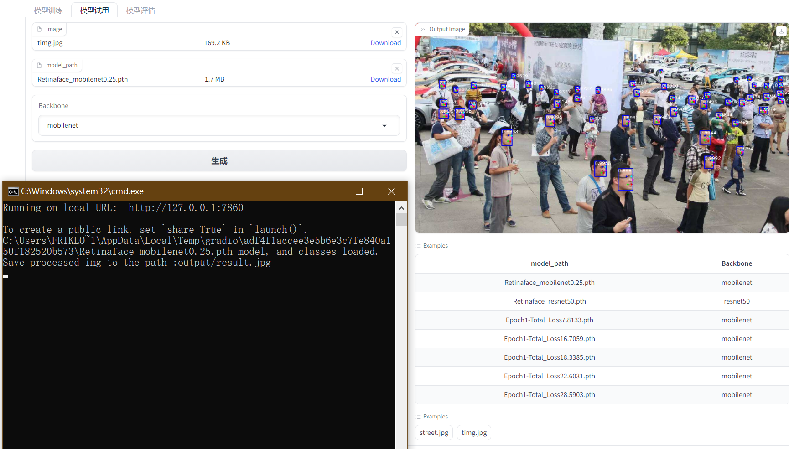

# RetinaFace人脸检测模型文档
## 前言
该项目实现了Retinaface人脸检测模型的训练、测试和评估,可以帮助用户快速上手Retinaface模型。
Retinaface是一种单阶段的人脸检测模型,具有高精度和高效率的优点。该项目将Retinaface应用到人脸检测任务上,实现了模型的端到端流程。
## 总体功能
- 模型训练:支持多种backbone,加载预训练权重,冻结权重等
- 模型测试:预测人脸框,可视化结果
- 模型评估:利用数据集计算指标,可视化结果


## 模型训练


通过RetinaFaceTrainer类进行模型训练。
主要参数:
- backbone:resnet50、mobilenet等
- pretrained:是否加载预训练权重
- freeze_stage:冻结的stage
- model_path:保存路径
主要函数:train_retinaface
## 模型试用

通过detect_image函数测试模型。
主要参数:
- img_raw:输入图片
- model_path:模型路径
- backbone:选择backbone
主要函数:detect_image_change
## 模型评估

通过test函数评估模型。
主要参数:
- model_path:模型路径
- backbone:选择backbone
主要函数:evaluation_test
## retinaface_trainer.py
1. 导入所需的Python库:
   - time - 用于计算时间
   - cv2 - OpenCV图像处理库
   - numpy - 数值计算库
   - torch - PyTorch深度学习框架
   - torch.nn - PyTorch的神经网络模块
2. 导入RetinaFace相关组件:
   - nets/retinaface.py - 包含RetinaFace模型的网络定义
   - utils/anchors.py - 用于生成 Anchor boxes
   - utils/config.py - 包含RetinaFace的配置文件
   - utils/utils.py - 各种图像处理和数据处理工具函数
   - utils/utils_bbox.py - 包含目标检测相关的解码、NMS等函数
3. 定义Retinaface类:
   - 设置默认参数 - 模型路径、backbone、置信度阈值等
   - 初始化 - 加载配置文件、构建Anchor、加载模型
   - generate方法 - 构建RetinaFace模型,加载预训练权重
   - detect_image - 人脸检测pipeline
   - get_FPS - 计算FPS
   - get_map_txt - 生成map计算所需的txt文件
4. 在detect_image内部实现了letterbox预处理、模型前向推理、解码预测框、NMS抑制等流程,生成最后的人脸检测结果
5. 获取FPS可以评估模型的实际推理速度
6. 生成map txt文件可以进行精度mAP指标的评估
7. 整体实现了一个人脸检测模型的加载和使用,提供了基本的评估工具,可以灵活应用到实际产品中

```python
import numpy as np
import torch
import torch.backends.cudnn as cudnn
import torch.optim as optim
from torch.utils.data import DataLoader
from nets.retinaface import RetinaFace
from nets.retinaface_training import MultiBoxLoss, weights_init
from utils.anchors import Anchors
from utils.callbacks import LossHistory
from utils.config import cfg_mnet, cfg_re50
from utils.dataloader import DataGenerator, detection_collate
from utils.utils_fit import fit_one_epoch


class RetinaFaceTrainer:
    def __init__(self, Cuda=True, training_dataset_path='./data/widerface/train/label.txt',
                 backbone="mobilenet", pretrained=True, model_path='',
                 Freeze_Train=True, num_workers=4):
        self.Cuda = Cuda  # 是否使用GPU
        self.training_dataset_path = training_dataset_path  # 人脸标注文件的路径
        self.backbone = backbone  # 选择mobilenet或resnet50为特征提取网络
        self.pretrained = pretrained  # 是否使用预训练权重
        self.model_path = model_path  # 模型权重地址
        self.Freeze_Train = Freeze_Train  # 是否进行冻结训练
        self.num_workers = num_workers  # 使用4个workers线程从DataLoader中读取数据

    def load_model(self):
        if self.backbone == "mobilenet":
            cfg = cfg_mnet
        elif self.backbone == "resnet50":
            cfg = cfg_re50
        else:
            raise ValueError('Unsupported backbone - `{}`, Use mobilenet, resnet50.'.format(self.backbone))

        model = RetinaFace(cfg=cfg, pretrained=self.pretrained)
        if not self.pretrained:
            weights_init(model)
        if self.model_path != '':
            device = torch.device('cuda' if torch.cuda.is_available() else 'cpu')
            model_dict = model.state_dict()
            pretrained_dict = torch.load(self.model_path, map_location=device)
            pretrained_dict = {k: v for k, v in pretrained_dict.items() if np.shape(model_dict[k]) == np.shape(v)}
            model_dict.update(pretrained_dict)
            model.load_state_dict(model_dict)

        model_train = model.train()
        if self.Cuda:
            model_train = torch.nn.DataParallel(model)
            cudnn.benchmark = True
            model_train = model_train.cuda()

        anchors = Anchors(cfg, image_size=(cfg['train_image_size'], cfg['train_image_size'])).get_anchors()
        if self.Cuda:
            anchors = anchors.cuda()

        criterion = MultiBoxLoss(2, 0.35, 7, cfg['variance'], self.Cuda)
        loss_history = LossHistory("logs/")

        return model,model_train, anchors, criterion, loss_history

    def freeze_train(self):
        model,model_train, anchors, criterion, loss_history = self.load_model()

        lr = 1e-3
        # 学习率大收敛快
        Batch_size = 8
        Init_Epoch = 0
        Freeze_Epoch = 2

        optimizer = optim.Adam(model_train.parameters(), lr, weight_decay=5e-4)
        lr_scheduler = optim.lr_scheduler.StepLR(optimizer, step_size=1, gamma=0.92)

        train_dataset = DataGenerator(self.training_dataset_path, cfg_mnet['train_image_size'])
        gen = DataLoader(train_dataset, shuffle=True, batch_size=Batch_size, num_workers=self.num_workers,
                         pin_memory=True, drop_last=True, collate_fn=detection_collate)
        epoch_step = train_dataset.get_len() // Batch_size

        if self.Freeze_Train:
            for param in model.body.parameters():
                param.requires_grad = False

        for epoch in range(Init_Epoch, Freeze_Epoch):
            fit_one_epoch(model_train, model, loss_history, optimizer, criterion, epoch, epoch_step, gen,
                          Freeze_Epoch, anchors, cfg_mnet, self.Cuda)
            lr_scheduler.step()

        lr = 1e-4
        # 学习率小防止震荡
        Batch_size = 4
        Freeze_Epoch = 2
        Unfreeze_Epoch = 4

        optimizer = optim.Adam(model_train.parameters(), lr, weight_decay=5e-4)
        lr_scheduler = optim.lr_scheduler.StepLR(optimizer, step_size=1, gamma=0.92)

        train_dataset = DataGenerator(self.training_dataset_path, cfg_mnet['train_image_size'])
        gen = DataLoader(train_dataset, shuffle=True, batch_size=Batch_size, num_workers=self.num_workers,
                         pin_memory=True, drop_last=True, collate_fn=detection_collate)
        epoch_step = train_dataset.get_len() // Batch_size

        if self.Freeze_Train:
            for param in model.body.parameters():
                param.requires_grad = True

        for epoch in range(Freeze_Epoch, Unfreeze_Epoch):
            fit_one_epoch(model_train, model, loss_history, optimizer, criterion, epoch, epoch_step, gen,
                          Unfreeze_Epoch, anchors, cfg_mnet, self.Cuda)
            lr_scheduler.step()


```

## enpredict .py
这段代码的主要功能是人脸检测:
1. 导入必要的库:opencv、numpy等。
2. 从enretinaface模块中导入Retinaface类,用于加载Retinaface模型。
3. 定义了一些参数:mode、视频路径、保存路径、FPS等。
4. 定义detect_image函数,传入原图像路径、模型路径、网络backbone参数,以及临时保存图像的路径。
5. 在detect_image函数中:
  - 读取原图
  - 将BGR转RGB
  - 使用Retinaface模型进行预测
  - 将预测图像转回BGR
  - 显示和保存预测结果图像
6. 所以这段代码的主要作用是加载Retinaface模型,进行人脸检测预测,并可视化和保存结果。
7. 通过设置不同的mode参数,可以进行图片预测、摄像头预测、视频文件预测等。
8. detect_image封装了人脸检测的主要过程,可以灵活应用到不同的模型和数据上。
综上,这段代码实现了一个人脸检测的示例,主要工作是加载模型、图像处理、模型预测、结果可视化等。
```python
import time

import cv2
import numpy as np

from enretinaface import Retinaface

mode = "predict"
video_path = 0
video_save_path = ""
video_fps = 25.0
test_interval = 100
dir_origin_path = "img/"
dir_save_path = "img_out/"


def detect_image(img, model_path, backbone, temp_img_path):
    retinaface = Retinaface(model_path=model_path, backbone=backbone)

    image = cv2.imread(img)
    if image is None:
        print('Open Error! Try again!')
        return
    else:
        image = cv2.cvtColor(image, cv2.COLOR_BGR2RGB)
        r_image = retinaface.detect_image(image)
        r_image = cv2.cvtColor(r_image, cv2.COLOR_RGB2BGR)
        # cv2.imshow("after", r_image)
        # cv2.waitKey(0)
        if temp_img_path != "":
            # 保存到临时文件
            cv2.imwrite(temp_img_path, r_image)
            print("Save processed img to the path :" + temp_img_path)
            return temp_img_path


```

## eneva .py
这段代码的主要功能是进行RetinaFace模型的mAP评估:
1. 导入必要的库:os、cv2、numpy、matplotlib等
2. 从enretinaface导入Retinaface模型类
3. 定义了一些可视化mAP的函数:plot_precision_recall_curve、plot_ap_bar_chart
4. 定义了test函数,传入RetinaFace模型路径及网络backbone参数
5. 在test函数内:
  - 构建Retinaface对象,设置评估时的阈值
  - 载入WIDER FACE验证集的图像路径、ground truth路径
  - 遍历所有图像,利用Retinaface生成预测结果txt文件保存
  - 将所有预测结果和ground truth传入evaluation函数计算mAP
  - 将mAP及精确率召回率曲线数据可视化并保存
6. 最后返回可视化结果图像路径
7. 所以该代码主要实现了对RetinaFace模型在WIDER FACE数据集上进行评估,计算mAP指标,并将精确率/召回率曲线等信息可视化,用于分析模型效果。
8. 通过test函数可以方便地对任意模型进行mAP评估。
综上,该代码的主要贡献是实现了RetinaFace在人脸检测任务上的mAP评估和结果可视化。
```python
import os
import cv2
import numpy as np
import tqdm
import matplotlib.pyplot as plt
from enretinaface import Retinaface
from utils.enutils_map import evaluation
def plot_precision_recall_curve(precisions, recalls):
    plt.plot(recalls, precisions)
    plt.xlabel('Recall')
    plt.ylabel('Precision')
    plt.title('Precision-Recall Curve')
    plt.grid(True)
    plt.savefig('precision_recall_curve.png')  # Save the plot to local file
    plt.close()
    # plt.show()

# Function to plot the AP bar chart
def plot_ap_bar_chart(aps):
    labels = ['Easy', 'Medium', 'Hard']
    x = np.arange(len(labels))
    plt.bar(x, aps)
    plt.xlabel('Difficulty Setting')
    plt.ylabel('AP')
    plt.title('Average Precision (AP) by Difficulty Setting')
    plt.xticks(x, labels)
    plt.savefig('ap_bar_chart.png')  # Save the plot to local file
    plt.close()
    # plt.show()

def test(model_path, backbone):
    mAP_retinaface = Retinaface(model_path=model_path, backbone=backbone, confidence=0.01, nms_iou=0.45)
    save_folder = './widerface_evaluate/widerface_txt/'
    gt_dir = "./widerface_evaluate/ground_truth/"
    imgs_folder = './data/widerface/val/images/'
    sub_folders = os.listdir(imgs_folder)

    test_dataset = []
    for sub_folder in sub_folders:
        image_names = os.listdir(os.path.join(imgs_folder, sub_folder))
        for image_name in image_names:
            test_dataset.append(os.path.join(sub_folder, image_name))

    num_images = len(test_dataset)

    # 存储精确率和召回率数据
    precisions = []
    recalls = []
    aps = []

    for img_name in tqdm.tqdm(test_dataset):
        image = cv2.imread(os.path.join(imgs_folder, img_name))
        image = cv2.cvtColor(image, cv2.COLOR_BGR2RGB)
        results = mAP_retinaface.get_map_txt(image)

        save_name = save_folder + img_name[:-4] + ".txt"
        dirname = os.path.dirname(save_name)
        if not os.path.isdir(dirname):
            os.makedirs(dirname)

        with open(save_name, "w") as fd:
            file_name = os.path.basename(save_name)[:-4] + "\n"
            bboxs_num = str(len(results)) + "\n"
            fd.write(file_name)
            fd.write(bboxs_num)
            for box in results:
                x = int(box[0])
                y = int(box[1])
                w = int(box[2]) - int(box[0])
                h = int(box[3]) - int(box[1])
                confidence = str(box[4])
                line = str(x) + " " + str(y) + " " + str(w) + " " + str(h) + " " + confidence + " \n"
                fd.write(line)

    # 计算精确率和召回率数据
    precision, recall, ap = evaluation(save_folder, gt_dir)
    precisions.append(precision)
    recalls.append(recall)
    aps.append(ap)

    # 处理精确率和召回率数据
    precisions = np.array(precisions)
    recalls = np.array(recalls)
    precisions = np.mean(precisions, axis=0)
    recalls = np.mean(recalls, axis=0)
    precisions = np.squeeze(precisions)
    recalls = np.squeeze(recalls)

    np.savetxt('precisions.txt', precisions)
    np.savetxt('recalls.txt', recalls)
    np.savetxt('aps.txt', aps)
    # Plot Precision-Recall Curve
    # Load the data from the local files
    precisions = np.loadtxt('precisions.txt')
    recalls = np.loadtxt('recalls.txt')
    aps = np.loadtxt('aps.txt')
    # Plot Precision-Recall Curve
    plot_precision_recall_curve(precisions, recalls)

    # Plot AP Bar Chart
    plot_ap_bar_chart(aps)
    return "precision_recall_curve.png","ap_bar_chart.png"

```

## UI界面代码
这段代码实现了一个RetinaFace模型的训练、预测和评估的可视化交互界面:
1. 导入必要的模块:gradio、RetinaFace相关模块等
2. 定义了3个函数:
   - train_retinaface: 用于训练RetinaFace模型
   - detect_image_change: 用于人脸检测预测
   - evaluation_test: 用于模型mAP评估
3. 使用gradio构建了一个交互界面,包含3个Tab:
   - Tab1:模型训练。可以配置各种超参数进行模型训练
   - Tab2:模型预测。可以上传图像进行预测
   - Tab3:模型评估。可以进行mAP评估并可视化结果
4. 使用gr.Examples提供了示例配置,方便用户快速上手
5. 3个Tab通过gr.Button绑定到对应的函数上,实现交互操作
6. 界面提供直观的输入输出显示,同时输出训练日志到console
7. 该程序实现了一个友好的RetinaFace模型操作界面,集成了模型的训练、预测、评估等核心功能。
8. 通过该界面可以方便地对模型进行调试和测试,降低使用门槛,具有很好的可视化和交互性。
总体来说,本代码利用gradio实现了一个RetinaFace模型操作的可视化交互界面,具有训练、预测、评估等核心功能,可以便捷地使用和调试模型。

```python
import gradio as gr
from retinaface_trainer import RetinaFaceTrainer
from enpredict import detect_image
from eneva import test


def train_retinaface(Cuda=True, training_dataset_path='./data/widerface/train/label.txt',
                     backbone="mobilenet", pretrained=False, model_path='',
                     Freeze_Train=True, num_workers=4):
    trainer = RetinaFaceTrainer(Cuda, training_dataset_path, backbone, pretrained, model_path, Freeze_Train,
                                int(num_workers))
    trainer.freeze_train()

    return "训练结束，具体情况请在控制台中查看"


def detect_image_change(image, model_path, backbone):
    image_path = image.name
    model_path = model_path.name
    temp_img_path = "output/result.jpg"
    result = detect_image(image_path, model_path, backbone, temp_img_path)
    return result


def evaluation_test(model_path, backbone):
    model_path = model_path.name
    img_path_1, img_path_2 = test(model_path, backbone)
    print(img_path_1, img_path_2)
    return img_path_1, img_path_2

if __name__ == "__main__":

    with gr.Blocks() as demo:
        # 顶部文字
        gr.Markdown("""
        # Retinaface模型
        项目运行具体情况请在控制台中查看
        ### 1. 模态一：模型训练
        点击example即可自动填充预设训练方式
        如果设置了model_path，则主干的权值无需加载，pretrained的值无意义,默认pretrained = False，Freeze_Train = True。
        如果不设置model_path，pretrained = True，此时仅加载主干开始训练。默认pretrained = True，Freeze_Train = True。
        如果不设置model_path，pretrained = False，Freeze_Train = False，此时从0开始训练，且没有冻结主干的过程。
    
        ### 2. 模态二：模型试用
        点击example即可自动填充预设模型和测试用图
        ### 3. 模态三：模型评估
        点击example即可自动填充预设模型
        """)

        with gr.Tabs():
            with gr.TabItem("模型训练"):
                # 一行 两列 左边一列是输入 右边一列是输出
                with gr.Row():
                    with gr.Column():  # 左边一列是输入
                        use_cuda = gr.Checkbox(label="Use CUDA")
                        dataset_path = gr.Textbox(label="Training Dataset Path")
                        backbone = gr.Dropdown(['mobilenet', 'resnet50'], label="Backbone")
                        use_pretrained = gr.Checkbox(label="Use Pretrained")
                        model_path = gr.Textbox(label="Model Path (if available)")
                        freeze_training = gr.Checkbox(label="Freeze Training")
                        num_workers = gr.Number(label="Number of Workers")
                        with gr.Row():
                            train_button = gr.Button("开始训练")

                    with gr.Column():
                        x_output = gr.Textbox(label="Training Log")
                        gr.Examples(
                            examples=[[True,
                                       './data/widerface/train/label.txt',
                                       "mobilenet",
                                       False,
                                       'model_data/Retinaface_mobilenet0.25.pth',
                                       True,
                                       4],
                                      [True,
                                       './data/widerface/train/label.txt',
                                       "resnet50",
                                       False,
                                       'model_data/Retinaface_resnet50.pth',
                                       True,
                                       4],
                                      [True,
                                       './data/widerface/train/label.txt',
                                       "mobilenet",
                                       True,
                                       '',
                                       True,
                                       4],
                                      [True,
                                       './data/widerface/train/label.txt',
                                       "mobilenet",
                                       False,
                                       'model_data/Retinaface_mobilenet0.25.pth',
                                       False,
                                       4],
                                      ],
                            inputs=[use_cuda, dataset_path, backbone, use_pretrained,
                                    model_path, freeze_training, num_workers])

            train_button.click(fn=train_retinaface,
                               inputs=[use_cuda, dataset_path, backbone, use_pretrained,
                                       model_path, freeze_training, num_workers],
                               outputs=x_output)
            with gr.TabItem("模型试用"):
                # 一行 两列 左边一列是输入 右边一列是输出
                with gr.Row():
                    with gr.Column():  # 左边一列是输入
                        image_input = gr.File(label="Image")
                        model_input = gr.File(label="model_path")
                        bone_input = gr.Dropdown(['mobilenet', 'resnet50'], label="Backbone")

                        # 生成、重置按钮（row：行）
                        with gr.Row():
                            image_button = gr.Button("生成")
                    with gr.Column():  # 右边一列是输出
                        # 输出框
                        image_output = gr.Image(label="Output Image")

                        # 样例框
                        gr.Examples(
                            examples=[
                                ["model_data/Retinaface_mobilenet0.25.pth", "mobilenet"],
                                ["model_data/Retinaface_resnet50.pth", 'resnet50'],
                                ["logs/Epoch1-Total_Loss7.8133.pth", "mobilenet"],
                                ["logs/Epoch1-Total_Loss16.7059.pth", "mobilenet"],
                                ["logs/Epoch1-Total_Loss18.3385.pth", "mobilenet"],
                                ["logs/Epoch1-Total_Loss22.6031.pth", "mobilenet"],
                                ["logs/Epoch1-Total_Loss28.5903.pth", "mobilenet"],
                            ],
                            inputs=[model_input, bone_input]
                        )

                        # 样例框
                        gr.Examples(
                            examples=[
                                "img/street.jpg",
                                "img/timg.jpg"
                            ],
                            inputs=[image_input]
                        )
            image_button.click(fn=detect_image_change,
                               inputs=[image_input, model_input, bone_input],
                               outputs=image_output),

            with gr.TabItem("模型评估"):
                # 一行 两列 左边一列是输入 右边一列是输出
                with gr.Row():
                    with gr.Column():  # 左边一列是输入
                        test_model_input = gr.File(label="model_path")
                        test_bone_input = gr.Dropdown(['mobilenet', 'resnet50'], label="Backbone")

                        # 生成、重置按钮（row：行）
                        with gr.Row():
                            eva_button = gr.Button("测试")
                    with gr.Column():  # 右边一列是输出
                        # 输出框
                        test_image_output_1 = gr.Image(label="Output Image")
                        test_image_output_2 = gr.Image(label="Output Image")
                        # 样例框
                        gr.Examples(
                            examples=[
                                ["model_data/Retinaface_mobilenet0.25.pth", "mobilenet"],
                                ["model_data/Retinaface_resnet50.pth", 'resnet50'],
                                ["logs/Epoch1-Total_Loss7.8133.pth", "mobilenet"],
                                ["logs/Epoch1-Total_Loss16.7059.pth", "mobilenet"],
                                ["logs/Epoch1-Total_Loss18.3385.pth", "mobilenet"],
                                ["logs/Epoch1-Total_Loss22.6031.pth", "mobilenet"],
                                ["logs/Epoch1-Total_Loss28.5903.pth", "mobilenet"],
                            ],
                            inputs=[test_model_input, test_bone_input]
                        )
            eva_button.click(fn=evaluation_test,
                             inputs=[test_model_input, test_bone_input],
                             outputs=[test_image_output_1, test_image_output_2]),
    demo.launch()

```


## 运行环境
打包方式基于
[半自动化使用.bat手动打包迁移python项目
](https://blog.csdn.net/qq_42531954/article/details/131843603?spm=1001.2014.3001.5501)
- Python 3.8
- OpenCV
- Pytorch
- dlib
- gradio

```bash
rem 创建虚拟环境 
python -m venv venv
call venv\Scripts\activate.bat
pip install -i https://mirrors.aliyun.com/pypi/simple/ -r re.txt


python -m pip install -i https://mirrors.aliyun.com/pypi/simple/ --upgrade pip setuptools
pip install dlib-19.19.0-cp38-cp38-win_amd64.whl.whl
pip install -i https://mirrors.aliyun.com/pypi/simple/ opencv-python==4.5.3.56
pip install torch-1.7.1+cu110-cp38-cp38-win_amd64.whl
pip install torch==1.7.1+cu110 torchvision==0.8.2+cu110 torchaudio==0.7.2 -f https://download.pytorch.org/whl/torch_stable.html
pip install -i https://mirrors.aliyun.com/pypi/simple/ gradio
pip install -i https://mirrors.aliyun.com/pypi/simple/ scikit-learn
pip install -i https://mirrors.aliyun.com/pypi/simple/ -r requirements.txt
```

```bash
scipy==1.7.1
numpy==1.21.2
matplotlib==3.4.3
opencv_python==4.5.3.56
torch==1.7.1
torchvision==0.8.2
tqdm==4.62.2
Pillow==8.3.2
h5py==2.10.0
```
